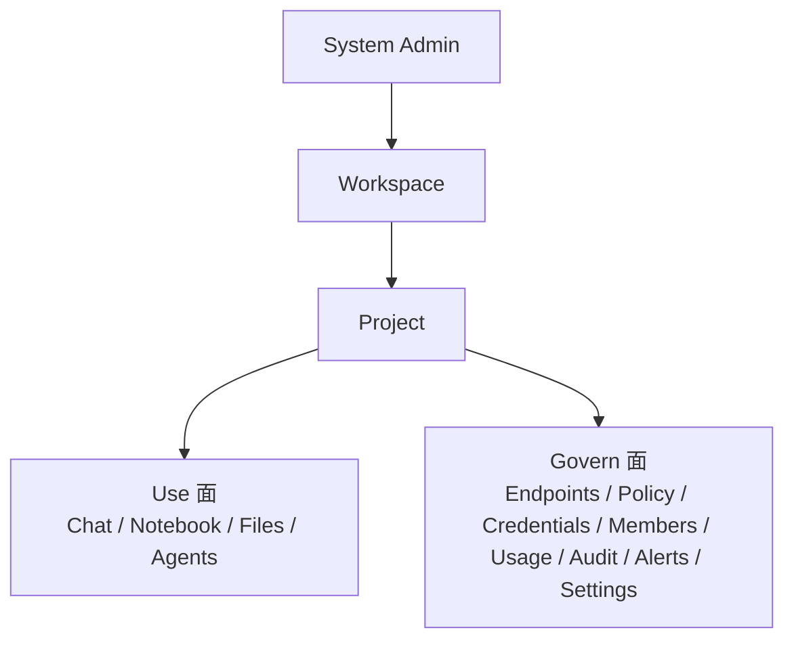

# 01. 产品综述与 PRD 使用说明

## 1.1 为什么需要这套 PRD

AgentSmith 已经不是一个只有几个页面和几个接口的早期原型。它同时涉及：

1. 系统级 workspace 控制面
2. workspace 与 project 的治理关系
3. Chat、Notebook、Files、Agents 等使用面
4. Endpoints、Policy、Usage、Audit 等治理面
5. agent execution、sandbox、skill、tenant isolation 等关键底层能力

如果没有一套真正结构化的 PRD，团队很容易在协作中出现以下问题：

1. 文档和实现各说各话
2. 模块都在做，但没人能说清产品主线
3. 路线图被“下一个页面”驱动，而不是被关键闭环驱动
4. 外部沟通和内部交付没有统一版本

因此，这套 PRD 的目的不是“写更多字”，而是给 AgentSmith 建立一个统一、可执行、可演进的产品叙事和需求基线。

## 1.2 文档目标

本 PRD 文档集服务于以下协作目标：

| 目标 | 说明 |
|---|---|
| 统一产品语言 | 统一 AgentSmith 的产品定位、术语、边界与对象模型 |
| 对齐实现现状 | 将仓库真实实现与产品叙事对齐，避免“文档比代码领先太多” |
| 支撑后续规划 | 为下一阶段的 workspace provisioning、租户隔离、agent sandbox、skill 生态等能力提供清晰路线 |
| 提升交付质量 | 为设计、研发、测试、验收提供统一依据 |

## 1.3 产品一句话定义

AgentSmith 是 MBOS 的企业级多租户 AI 控制平面，同时也是通用智能体的易用且安全的运行环境与统一用户接口，用于管理工作区生命周期、项目级 AI 使用、资源治理、权限审计与任务执行。

## 1.3.1 双主线定位说明

如果只把 AgentSmith 理解成“企业 AI 治理平台”，会漏掉一个越来越重要的产品事实：它正在承接的不只是资源治理，还包括通用智能体的标准化运行。

更准确的说法是，AgentSmith 正在同时解决两类问题：

1. 企业如何安全、可控、可审计地组织 AI 使用。
2. 通用智能体如何以更低门槛、更安全、更可协作的方式被真实团队使用。

这也是为什么 `Notebook`、`Files`、`Agents`、`sandbox runtime`、`builtin skills`、`credential files` 在 PRD 中不能只被写成零散模块。它们组合起来，构成的是一个统一的智能体操作环境。

## 1.4 当前产品形态总结

当前产品已经形成三层清晰结构：

其中：

1. `System Admin` 负责 workspace 生命周期与底层配置。
2. `Workspace` 是真实租户边界，不是纯前端分组。
3. `Project` 是业务与治理的主要作用域。
4. `Use` 面承载 AI 使用，也是通用智能体被统一操作和安全运行的主要入口。
5. `Govern` 面承载约束、证据、配置与审查。

## 1.4.1 当前产品的关键产品特征

从更高层的产品语言看，AgentSmith 当前已经形成了四个相互勾连的特征：

1. 它有明确的 system -> workspace -> project 多层控制面结构。
2. 它把 Chat、Notebook、Files、Agents 组织成统一的项目内使用面。
3. 它把 Endpoints、Policy、Usage、Audit、Alerts 组织成统一的治理与证据面。
4. 它正在把通用智能体从“个人命令行工具”升级为“项目级、可托管、可复用的运行能力”。

## 1.5 这套 PRD 解决什么问题

### 对产品负责人

它帮助回答：

1. AgentSmith 到底是什么产品
2. 当前已经做到哪一步
3. 后续最应该优先补哪些闭环
4. 为什么“治理平台”和“智能体运行环境”必须作为同一个产品来设计

### 对设计与前端

它帮助回答：

1. 页面结构为什么这样设计
2. 哪些对象是用户需要理解的，哪些只是实现细节
3. 哪些异常与状态必须被明确表达
4. 为什么 Notebook 需要承担统一智能体操作界面的职责

### 对后端与架构

它帮助回答：

1. 哪些能力是产品承诺，哪些只是内部实现
2. 哪些模块是主线，哪些不能继续膨胀
3. 哪些路线图是合理延伸，哪些是边界漂移
4. 为什么文件系统、凭据、skills 和 sandbox 不能被割裂设计

### 对测试与验收

它帮助回答：

1. 应该验证哪些主链路
2. 如何区分已实现、部分实现与规划中
3. 验收标准应围绕什么来组织

## 1.6 本 PRD 的状态说明机制

为避免误导，本文档统一使用以下状态标签：

| 标签 | 含义 |
|---|---|
| `已实现` | 仓库代码、路由、模块或后端逻辑已具备，且可从文档/测试中验证 |
| `部分实现` | 主链路、状态机、页面或协议已存在，但闭环仍不完整 |
| `规划中` | 在仓库文档、代码方向或产品规划中已被明确提及，但当前未完全实现 |

## 1.7 PRD 的边界

本 PRD 主要覆盖：

1. 产品定位与边界
2. 用户角色与权限
3. 信息架构与模块职责
4. 现有功能与规划功能
5. 技术架构与非功能要求
6. 验收与里程碑建议

本 PRD 不替代以下文档：

1. OpenAPI / AsyncAPI 机器可读合同
2. 单模块前端组件规范
3. 详细开发 runbook
4. 单元测试与集成测试实现细节

## 1.8 如何阅读这套文档

如果你是第一次接触这个项目，建议按下面顺序阅读：

1. `02` 先理解产品定位和边界
2. `03` 再理解角色与权限模型
3. `04` 看整体信息架构
4. `05`、`06` 理解控制面与治理主线
5. `07`、`08` 理解使用面与治理面
6. `13` 用用户故事和任务流把整套结构串起来
7. `11`、`12` 再看路线图与验收

## 1.9 本次重构 PRD 的核心价值

本次重构的重点不是“再写一份更长的介绍”，而是完成五件事：

1. 把当前已实现产品面完整收敛成一个可讲清的产品体系。
2. 把尚未完成但方向明确的能力从代码碎片中抽出，变成清晰 roadmap。
3. 把系统管理侧、工作区侧、项目侧、agent 执行侧放进同一个高层模型中描述。
4. 把 User Story、任务流、功能要求和验收标准连接起来，让 PRD 更接近真正可执行的交付文档。
5. 把“企业级治理平台”与“通用智能体运行环境”两条主线合并成统一叙事，而不是继续割裂表达。
