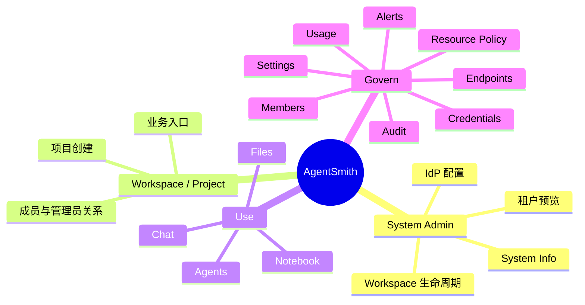

# 02. 产品定位、目标与范围边界

## 2.1 背景

企业在真正把 AI 接入业务之后，问题很快就不再是“能否调用模型”，而是：

1. 多个团队如何在一个可治理的环境中使用 AI。
2. Chat、Notebook、Agent、Files 等不同工作流如何共享同一套资源和约束体系。
3. 管理者如何知道谁在使用什么、消耗了多少、哪里出现了异常。
4. 平台如何在不失控的前提下演进到托管执行、技能生态和更严格的多租户隔离。

AgentSmith 就是在这个背景下被定义出来的。它不是一个单点 AI 工具，而是一个企业级 AI 控制平面。

## 2.2 产品定位

AgentSmith 的正式定位是：

1. MBOS 的企业级多租户控制平面。
2. 企业级 AI 智能体使用与管理平台。
3. 项目级 AI 资源治理与审计平台。
4. 通用智能体的易用且安全的运行环境与统一用户接口。

如果用更接近业务负责人的语言描述，它是：

`一个让企业能够按 workspace 和 project 维度组织 AI 使用、治理资源、约束成本、运行通用智能体并追踪证据的平台。`

## 2.3 产品要解决的核心问题

### 2.3.1 管理问题

企业需要一个统一入口来管理：

1. workspace 生命周期
2. project 创建和治理边界
3. 身份来源和权限模型
4. 模型资源、agent、文件与凭据

### 2.3.2 使用问题

企业用户需要：

1. 用统一方式访问 Chat、Notebook、Files、Agents
2. 在项目上下文里共享输入、artifact 与执行结果
3. 不必自己理解底层协议、权限实现和执行环境差异

### 2.3.3 通用智能体运行问题

企业或技术团队在接入 OpenClaw 一类通用智能体时，通常还会遇到另一组非常现实的问题：

1. 安装和配置复杂，需要手工准备运行目录、模型连接、凭据和工具链。
2. 默认运行环境不够安全，常常直接依赖不受控的宿主机目录和权限。
3. 文件输入输出难管理，运行过程中的上下文、中间文件和结果容易散落。
4. 缺少统一用户界面，最终只能依赖命令行和脚本，难以被更广泛团队成员稳定使用。
5. 运行结果难以沉淀为项目资产，复用、追踪和协作成本很高。

AgentSmith 在这一层试图解决的，不只是“支持 agent”，而是把通用智能体运行升级为：

1. 可配置
2. 可托管
3. 可持久化
4. 可协作
5. 可审计

### 2.3.4 治理问题

管理员需要：

1. 配置 endpoint 资源
2. 对使用做 rate / spending 约束
3. 查看 usage、audit、异常和策略变更
4. 对项目治理动作形成可追溯证据

## 2.4 产品目标

### 2.4.1 业务目标

1. 让企业可以在工作区与项目维度安全使用 AI 能力。
2. 让普通用户低门槛使用 Chat、Notebook、Files、Agents 等 AI 生产力模块。
3. 让管理员以项目为单位配置 endpoint、权限、资源策略、凭据与审计能力。
4. 让系统管理员管理工作区生命周期、身份提供商配置与多租户隔离基线。

### 2.4.2 平台目标

1. 建立统一的 `project-scoped governance model`。
2. 将 Chat、Notebook、API/Proxy 调用纳入同一条 endpoint 约束链路。
3. 沉淀可追溯的 usage / audit / policy / execution evidence。
4. 为后续的 sandbox 托管执行、skill 生态、tenant isolation 强化奠定基础。
5. 为通用智能体提供统一的运行界面、文件系统接入方式和更安全的执行环境。

## 2.5 当前唯一主线

当前产品唯一治理主线是：

`项目级 LLM endpoint 统一约束链路`

它的含义不是一句口号，而是明确的产品约束：

1. Chat、Notebook、用户 API 调用共享同一套资源约束体系。
2. 当前 MVP 治理主对象是 `endpoint`。
3. Usage、Audit、Policy 的主要证据链也围绕 endpoint 展开。
4. 平台不允许再平行生长一套“Chat 自治理体系”或“Notebook 自治理体系”。

## 2.6 在范围内

| 一级范围 | 二级范围 | 价值说明 |
|---|---|---|
| 系统管理 | System Admin、Workspace 创建与配置、System Info | 让多租户边界与开通动作产品化 |
| 身份与授权 | Workspace 绑定 Keycloak、permission token、workspace/project 权限映射 | 保持身份外部化、授权内部化 |
| 项目对象 | Projects、Project Owner、Project Admin、Project Creator | 让业务与治理都围绕 project 组织 |
| AI 使用面 | Chat、Notebook、Files、Agents | 承接日常 AI 生产力工作流 |
| AI 治理面 | Endpoints、Resource Policy、Credentials、Members、Usage、Audit、Alerts、Settings | 承接可控、可追溯、可限制的治理要求 |
| 执行协议 | 外部 Agent WebSocket 协议、Notebook agent 执行链路 | 保证 agent 能以标准协议接入平台 |
| 智能体运行环境 | sandbox、task workspace、builtin skills、第三方凭据、文件库挂载 | 提供通用智能体统一、安全、可持久化的运行基础 |
| 证据体系 | usage evidence、audit evidence、policy evidence、trace | 支撑审计、追溯、诊断与平台化交付 |

## 2.7 不在范围内

| 不在范围内项 | 为什么不做 |
|---|---|
| DevOps 发布编排平台 | 仓库中的 `release`、`engineering gate` 只是研发流程术语，不是产品能力 |
| 组织级统一总控治理平台 | 当前先聚焦 workspace / project 主线，避免叙事过大 |
| 独立 Runtime 产品面 | `Runtime` 容易成为模糊大词，当前统一收敛到更具体职责中 |
| 文件级策略治理 | 当前策略主线聚焦 endpoint，避免 scope 漂移 |
| 多 IdP 编排 UI | 当前只支持 Keycloak，先把单一路线打深 |
| 复杂迁移/重命名工具 | 当前不做复杂基础设施迁移控制台 |

## 2.8 产品边界图

## 2.9 成功定义

从产品视角，AgentSmith 的阶段性成功，不是“页面齐全”，而是以下目标被满足：

1. 企业能以 workspace / project 为单位使用 AI，而不是各自为政。
2. 普通用户能在统一入口完成对话、任务执行、文件协作和 agent 工作流。
3. 管理员能对资源、成本、策略、成员和异常形成治理闭环。
4. 通用智能体能够在统一的 Notebook 界面和受控运行环境中被更广泛地使用，而不是只由少数技术用户在本地命令行中勉强维护。
5. 平台具备继续演进到托管执行、tenant isolation、skill ecosystem 的结构基础。

## 2.10 当前阶段判断

当前项目不是“从零开始的空壳”，也不是“所有能力都已闭环”。

更准确的判断是：

1. 前台产品面已经相当完整。
2. 工作区控制面已经具备明确状态模型和主要交互。
3. 多租户数据面隔离与 workspace provisioning 后台闭环仍在建设中。
4. Agent 内部托管执行与 skill 生态已经有明显结构，但距离最终平台形态还有一段路。

## 2.11 本章结论

本章最重要的结论不是“AgentSmith 做很多事”，而是它已经有一条足够清晰的产品边界：

1. 它不是单纯的模型调用平台。
2. 它也不是单纯的 agent 运行器。
3. 它的核心价值，在于把项目级治理、统一用户入口、受控运行环境和执行证据放进同一个系统中。

这也是后续所有模块设计、路线图取舍和对外叙事的判断基线。
