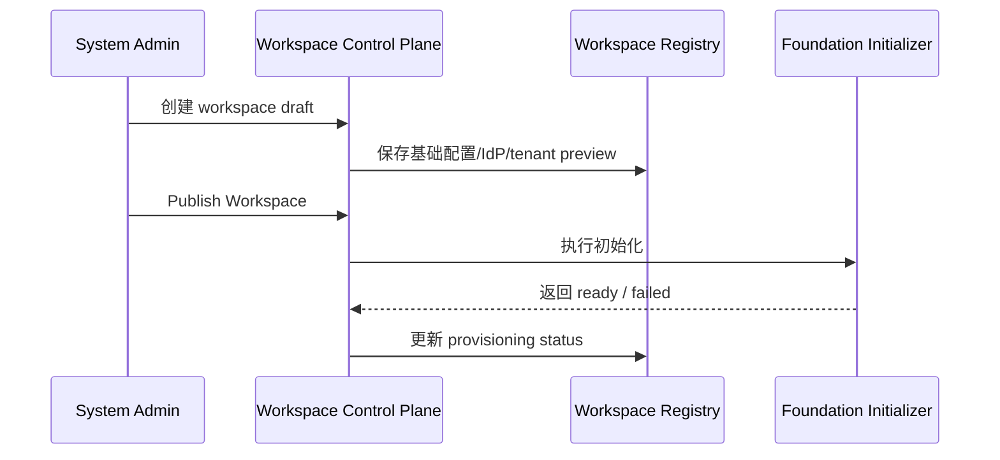

# 03. 用户角色、权限模型与核心场景

## 3.1 为什么这一章重要

AgentSmith 的复杂度并不主要来自页面数量，而是来自不同层级角色之间的边界管理。

如果角色与权限模型不清晰，就会发生三类问题：

1. 系统管理能力与业务治理能力混杂
2. owner / admin / creator 等关系标签演化成第二套鉴权系统
3. 前端、后端、文档和测试各自理解不同，最终导致权限漂移

因此，本章的目标不是简单列出角色名，而是明确：

1. 谁负责什么
2. 谁不负责什么
3. 权限判断最终依据什么
4. 典型任务流是如何跨角色完成的

## 3.2 用户角色总览

| 角色 | 作用域 | 核心职责 | 不是它要做的事 | 当前状态 |
|---|---|---|---|---|
| System Admin | 系统级 | 管理 workspace 生命周期、IdP、租户配置 | 不直接承担项目日常治理 | `已实现` |
| Workspace Admin | workspace 级 | 授权 project 创建、必要时强制转移 owner | 不管理 workspace 生命周期和 IdP | `已实现` |
| Project Creator | workspace 级授权 | 创建 project，创建后自动成为 owner | 不自动获得 workspace admin 身份 | `已实现` |
| Project Owner | project 级 | 生命周期、owner 转让、指定 project admin | 不等于系统或 workspace 管理者 | `已实现` |
| Project Admin | project 级 | 项目治理与配置管理 | 不可删除项目，不可转让 owner | `已实现` |
| Member | project 级 | 使用被授权的业务能力 | 不自动拥有治理权限 | `已实现` |

## 3.3 权限模型原则

### 3.3.1 总原则

1. `Authn` 由 workspace 绑定的 IdP 提供，当前仅支持 Keycloak。
2. `Authz` 由 AgentSmith 执行。
3. 运行时鉴权真相是 `permission token + scope`，不是角色名。
4. `WorkspaceAdmin`、`ProjectOwner`、`ProjectAdmin` 是关系标签和管理对象，不是第二套鉴权系统。

### 3.3.2 当前核心 project 权限

| 权限 | 作用 |
|---|---|
| `project:endpoint:use` | 使用 endpoint、访问 Chat/Notebook 等使用面 |
| `project:agent:manage` | 管理 agent |
| `project:agent:public` | 使用公开 agent 能力 |
| `project:audit:read` | 查看 audit |
| `project:governance:update` | 管理资源、策略、凭据等治理能力 |
| `project:membership:update` | 管理成员与加入流程 |
| `project:admins:update` | 管理 project admin |
| `project:lifecycle:update` | 生命周期与 owner 转移 |
| `project:manage` | 历史兼容项，不应再作为主鉴权真相 |

### 3.3.3 设计上的关键判断

这套权限模型有一个非常重要的产品意义：

`角色用于理解职责，permission 用于执行授权。`

这样做的好处是：

1. 页面不会因为角色名变化而大面积重写。
2. 后端鉴权不会散落成大量 owner/admin 特判。
3. 更适合未来扩展出细粒度治理能力。

## 3.4 身份边界

### 3.4.1 身份来源

1. Workspace 成员来源于外部 IdP。
2. AgentSmith 不维护 workspace 成员生命周期。
3. 只要用户存在于该 workspace IdP 中，即可被视为合法认证用户。

### 3.4.2 身份主键

系统统一采用：

1. `user_id = Keycloak sub`
2. `email` 用于搜索、展示与人工识别

这意味着：

1. Workspace admin、project creator、project owner、project admin 的落库真相都是 `user_id`。
2. UI 可以显示 `name + email`，但不能以 email 充当正式身份主键。

## 3.5 核心用户故事

### Story A：System Admin 开通一个新的 workspace

作为系统管理员，我希望能够先创建一个 workspace 草稿，再显式发布它，并看到初始化结果，这样我才能确定该 workspace 已经真正具备可访问性，而不是只保存了一条配置记录。

价值：

1. 把租户开通动作产品化
2. 降低“后台配置完成但业务不可用”的风险

### Story B：Workspace Admin 授权特定用户创建项目

作为 workspace 管理员，我希望授予某些成员 project 创建权限，而不需要把他们提升为 workspace 管理员，这样我可以分散项目创建职责，同时不扩大系统级权限面。

价值：

1. 降低权限过度授予
2. 适合业务团队自治

### Story C：Project Creator 创建项目并成为 owner

作为被授权的项目创建者，我希望在创建项目后自动成为该项目 owner，这样我能对自己发起的项目承担完整责任，而不需要额外管理员介入补权限。

价值：

1. 缩短项目启动路径
2. 让责任边界天然形成

### Story D：Project Owner 委派日常治理

作为 project owner，我希望把资源、策略、成员等日常治理工作分配给 project admin，同时保留 owner 转让与项目生命周期控制权，这样我可以委派工作，但不丢失最终责任。

价值：

1. 让治理与所有权分离
2. 防止单点管理瓶颈

### Story E：普通成员安全地使用 AI 能力

作为项目成员，我希望在一个统一的项目空间里使用 Chat、Notebook、Files 和 Agent，而不需要理解复杂权限与基础设施细节，同时系统应自动处理资源限制和审计记录。

价值：

1. 降低使用门槛
2. 保证平台可控性

### Story F：管理员追溯治理事件

作为项目管理员，我希望在 Audit 和相关治理模块中快速定位“谁改了什么、何时改的、影响了哪些资源”，这样我才能完成排查、复盘和治理判断。

价值：

1. 支撑审查
2. 支撑追责与改进

## 3.6 关键任务流

### 场景 A：系统管理员开通 workspace

当前状态：`部分实现`

原因：

1. `draft/provisioning/ready/failed/disabled` 状态已具备。
2. 发布时已经触发初始化。
3. 但后台初始化仍未覆盖全部 workspace 私有数据面。

### 场景 B：workspace admin 授权 project creator

任务流：

1. workspace admin 进入工作区设置页
2. 通过 Keycloak 用户目录搜索目标成员
3. 选择成员并保存
4. 系统以 `user_id` 持久化 project creator 授权
5. 用户后续可创建 project

当前状态：`已实现`

### 场景 C：project creator 创建项目并成为 owner

任务流：

1. 用户拥有 workspace 级 project 创建权限
2. 用户创建项目
3. 系统自动把其标记为该项目 owner
4. owner 可继续指定 project admin

当前状态：`已实现`

### 场景 D：成员使用 Chat / Notebook

任务流：

1. 成员进入项目
2. 选择 endpoint 或 external agent
3. 在 Chat 发起对话，或在 Notebook 创建任务
4. Notebook 可附加文件、URL、artifact 作为输入
5. 执行过程中写入 usage、audit、trace 等证据

当前状态：`已实现`

### 场景 E：管理员审查异常与治理证据

任务流：

1. 管理员在 Audit 查看最近事件和异常
2. 必要时进入 Resource Policy 或 Endpoints 继续定位问题
3. 在 Usage 查看用量与限制趋势
4. 形成治理判断或执行处置

当前状态：`已实现`

## 3.7 本章结论

AgentSmith 当前最大的角色设计价值在于：

1. 系统级、workspace 级、project 级职责已经基本解耦。
2. owner / admin / creator 的业务含义已经清晰。
3. permission token 正在成为唯一鉴权真相。

后续最重要的工作不是继续发明新角色，而是持续把所有功能面都折叠回这套稳定模型。
