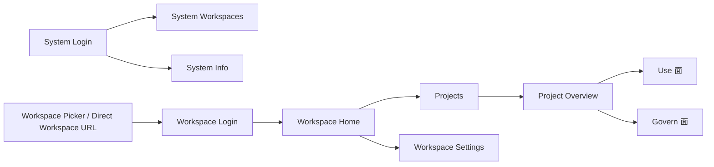
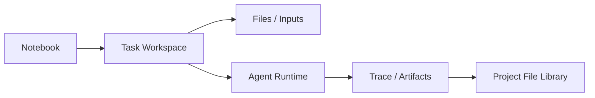

# 04. 产品信息架构与导航结构

## 4.1 为什么信息架构是关键问题

AgentSmith 不是单一工作台，而是一个层级清晰的控制平面产品。

如果信息架构处理不好，会出现三类典型失败：

1. 系统管理与业务使用入口混在一起，用户不知道自己当前在什么层级
2. workspace 与 project 的边界模糊，导致权限和上下文混乱
3. Use 面与 Govern 面各自生长，最后成为两套彼此割裂的产品

因此，本章要回答的不是“页面有哪些”，而是：

1. 用户如何理解自己在系统中的位置
2. 各层级导航为什么这样组织
3. 哪些模块应当被并列看待，哪些模块只是补充入口

## 4.2 信息架构原则

当前信息架构遵循以下原则：

1. 系统管理入口与业务入口严格分离。
2. 用户必须先进入 workspace 上下文，再进入业务登录。
3. Project 是 Use 与 Govern 模块的共同容器。
4. `Usage` 与 `Audit` 是治理主线中的用户可见核心面。
5. Notebook 应逐步成为通用智能体的统一操作界面，而 Files 则承接运行文件系统的持久化入口。

## 4.3 顶层结构

## 4.4 用户视角下的导航理解方式

### 4.4.1 系统管理员视角

系统管理员看到的是一条“开通与控制”主线：

1. 登录 system
2. 管理 workspaces
3. 查看 system info

### 4.4.2 业务用户视角

普通业务用户看到的是一条“进入 workspace -> 进入 project -> 使用或治理”主线：

1. 选择或直达 workspace
2. 登录 workspace
3. 进入 workspace home
4. 进入 project
5. 在项目里完成使用、治理，或通过 Notebook、Files、Agents 运行更复杂的智能体任务

### 4.4.3 项目管理员视角

项目管理员的核心任务不是“进入另一个后台”，而是在同一个 project 容器内，在 Use / Govern 两个面之间切换。

## 4.5 当前主导航模块

### 4.5.1 System 管理侧

| 模块 | 主要路由 | 说明 | 当前状态 |
|---|---|---|---|
| System Login | `/system/login` | 系统管理员独立登录入口 | `已实现` |
| System Workspaces | `/system/workspaces` | workspace 控制平面 | `已实现` |
| System Info | `/system/info` | 系统级基础状态页 | `已实现` |

### 4.5.2 Workspace 入口侧

| 模块 | 主要路由 | 说明 | 当前状态 |
|---|---|---|---|
| Workspace Picker | `/login/workspace` | 公开 workspace 选择页 | `已实现` |
| Workspace Login | `/workspaces/{workspace}/login` | workspace 业务登录 | `已实现` |
| Workspace Home | `/workspaces/{workspace}` | 工作区上下文入口 | `已实现` |
| Workspace Settings | `/workspaces/{workspace}/settings` | workspace 级业务设置 | `已实现` |

### 4.5.3 Project 内模块

| 分组 | 模块 | 产品意义 |
|---|---|---|
| Home | Overview | 项目入口与导航确认 |
| Use | Chat、Notebook、Files | 承接用户日常 AI 使用，并构成通用智能体统一操作界面 |
| Develop | Agents | 承接 agent 资源注册、执行能力接入与运行模式管理 |
| Govern | Endpoints、Resource Policy、Credentials、Members、Usage、Audit、Settings | 承接项目治理与证据 |
| Operate 语义 | 当前面向用户主要收敛进 Audit，内部执行相关路由仍存在 | 避免形成第三个模糊产品面 |

### 4.5.4 为什么 Notebook、Files、Agents 必须被连起来理解

从页面上看，它们是三个模块；从产品能力上看，它们共同组成一条智能体运行链路：

这条链路说明：

1. Notebook 不只是任务页，而是统一操作入口。
2. Files 不只是附件区，而是输入来源与持久化落点。
3. Agents 不只是资源清单，而是具体执行能力的注册与接入面。

### 4.5.5 补充模块

| 模块 | 路由 | 说明 |
|---|---|---|
| Alerts | `/alerts` | 项目级治理信号与热点提示 |
| User API Keys | `/user/api-keys` | 用户 API key 管理 |
| Third-Party Accounts | `/user/third-party-accounts` | 用户级外部账户与凭据管理 |
| Use Guide | `/use-guide` | 项目内使用指导页 |

## 4.6 结构设计背后的产品意图

### 4.6.1 为什么 Project 是中心容器

因为 AgentSmith 的使用和治理都不是围绕个人账户展开，而是围绕项目展开。

### 4.6.2 为什么 Use 与 Govern 要并列

因为这两者在产品上互相依赖：没有 Govern，Use 会失控；没有 Use，Govern 会失去实际业务对象。

### 4.6.3 为什么 Notebook 应被强调为统一智能体入口

很多通用智能体的问题，不是能力不够，而是运行方式停留在“本地终端 + 目录约定 + 手工配置”的阶段。

把 Notebook 放在核心导航里，背后的产品意图是：

1. 让用户通过任务视角，而不是命令行视角操作智能体。
2. 让输入、对话、trace、artifact 和结果在一个界面里完成闭环。
3. 让 AgentSmith 有机会把 sandbox、凭据、skills 和文件系统逐步托管起来。

### 4.6.4 为什么 Workspace Home 和 Project Overview 要克制

因为很多平台会在这里堆满“总览指标”，最后变成没人真正依赖、又难以维护的伪大盘。

更合理的做法是：

1. Workspace Home 负责上下文确认和导航
2. Project Overview 负责项目入口和任务导向
3. 真正的治理信息去 Usage、Audit、Alerts 等模块看

## 4.7 异常场景与设计约束

### 典型异常场景

1. 用户直达了无权限的 workspace 或 project
2. 用户进入了未 `ready` 的 workspace
3. 用户进入页面后发现没有可用 endpoint 或没有 agent 绑定
4. 用户拥有使用权限但不拥有治理权限
5. 用户希望运行通用智能体，但当前项目缺少可用 agent、sandbox 能力或可写文件落点

### 设计约束

1. 这些场景必须通过清晰门禁、空状态、错误状态表达出来
2. 不允许通过隐式重定向掩盖上下文错误
3. 不允许让用户通过 URL 猜测系统结构

## 4.8 信息架构判断

### 4.8.1 设计上的优点

1. 入口层级清晰，没有系统级与业务级混淆。
2. 项目壳层统一承载 Use/Govern 模块，便于扩展。
3. 权限门禁与路由结构基本一致。
4. Notebook、Files、Agents 已具备被组织成统一运行界面的信息架构基础。

### 4.8.2 当前仍需优化的点

1. `Operate` 语义仍有部分技术性残留，需要继续统一到 Audit 叙事。
2. Alerts、Audit、Usage 之间的边界还需持续通过产品文案稳固。
3. Workspace Home 与 Project Overview 的职责仍需避免演化为“伪大盘”。
4. 智能体运行环境相关能力目前仍分散在多个模块表达上，后续应继续通过产品文案和引导强化其统一性。

## 4.9 本章结论

从信息架构角度看，AgentSmith 当前最重要的正确选择是：

1. system 与 business 分离
2. workspace 先于 project
3. project 统一承接 use 与 govern
4. Notebook、Files、Agents 可以在同一项目上下文中逐步收敛成通用智能体统一运行界面

这为产品后续继续扩展能力提供了一个足够稳定的骨架。
