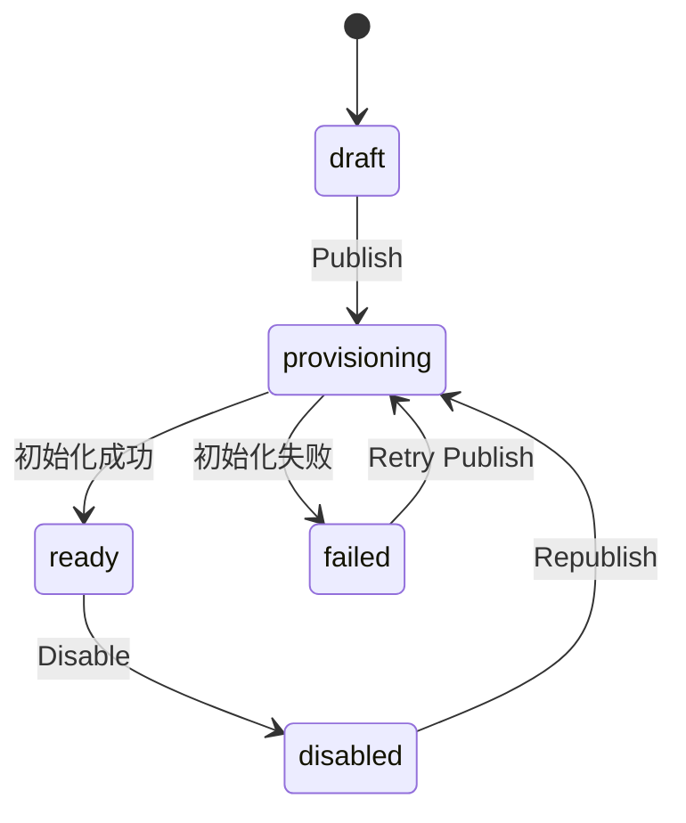
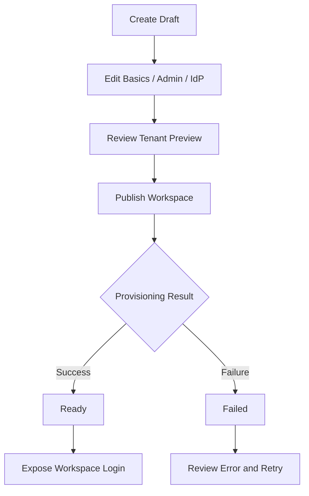

# 05. 系统管理侧：Workspace 控制平面 PRD

## 5.1 模块背景

在多租户平台里，`workspace` 不能只是一个前端概念标签。它必须承载：

1. 真实的租户边界
2. 对应的身份提供商配置
3. 对应的底层命名与隔离规则
4. 对外是否可访问的状态

如果 workspace 只是“保存一条配置记录”，而不是“完成一次可追踪的开通动作”，就会出现典型问题：

1. 管理员以为开通完成，但业务侧实际无法登录
2. 底层数据面没有按租户隔离生效
3. 失败没有状态、没有错误摘要、没有重试依据

因此，System Workspaces 的目标不是做一个表单页，而是建设一个克制但可信的控制平面。

## 5.2 模块定位

`System Workspaces` 是面向系统超级管理员的控制平面，用于管理 workspace 生命周期、IdP 配置、租户隔离预览与发布状态。

它不是：

1. 运营指标大盘
2. DevOps 发布编排面板
3. 项目级业务管理后台

## 5.3 目标

### 5.3.1 产品目标

1. 让系统管理员能安全地创建和发布 workspace。
2. 让 workspace 的对外可用状态变得清晰、可信、可追踪。
3. 让身份配置、租户配置和发布状态形成统一闭环。

### 5.3.2 用户目标

作为系统管理员，我希望：

1. 能先保存 draft，而不是被迫一次性提交所有内容。
2. 能看到系统自动生成的 tenant 配置，而不是自己手工拼数据库名。
3. 能在发布时得到清晰的成功/失败反馈。
4. 能区分“已保存配置”和“已真正可用”。

## 5.4 用户故事

### Story 1：创建 workspace 草稿

作为系统管理员，我希望先创建一个 workspace draft，填写基础信息、管理员与 IdP 配置，这样我可以先完成配置准备，再决定何时对外发布。

### Story 2：查看自动生成的租户预览

作为系统管理员，我希望系统自动生成数据库名、collection prefix 与 key prefix，而不是让我手工输入底层命名，这样我可以降低配置错误与漂移风险。

### Story 3：显式发布 workspace

作为系统管理员，我希望通过显式的 `Publish Workspace` 动作触发初始化，并在一个统一位置看到结果，这样我能清楚地知道 workspace 是“已配置”还是“已可用”。

### Story 4：在失败后得到可执行反馈

作为系统管理员，我希望当 workspace 发布失败时，系统能够展示错误摘要和最近一次初始化状态，这样我可以判断是否需要修复配置、重试发布或暂时停用。

## 5.5 核心对象

| 对象 | 关键字段 | 业务意义 |
|---|---|---|
| WorkspaceRecord | `id`、`name`、`workspace_admin`、`project_creators`、`idp`、`tenant`、`provisioning_status` | workspace 的主配置对象 |
| WorkspaceProvisioningRecord | `last_initialized_at`、`last_init_error`、`attempt_count`、`latest_attempt` | 反映 workspace 开通过程的证据与结果 |
| SystemInfoSnapshot | `workspace_registry_status`、`data_service_status`、`default_idp_status`、`workspace_provisioning` | 系统管理员观察基础状态的只读快照 |

## 5.6 功能需求

### 5.6.1 Workspace 创建与编辑

| 功能 | 需求说明 | 当前状态 |
|---|---|---|
| 创建 draft | 填写 workspace 基础信息、管理员、IdP 配置 | `已实现` |
| 自动 tenant preview | 自动生成 `database_name`、`collection_prefix`、`key_prefix` | `已实现` |
| 编辑 draft | 支持修改配置并重新保存 | `已实现` |
| 修改后回退为 draft | 关键配置变更后要求重新发布 | `已实现` |

详细要求：

1. workspace 名称需要可被系统稳定映射成 workspace id。
2. workspace admin 必须通过身份目录解析成正式 `user_id`。
3. IdP 当前只支持 Keycloak。
4. tenant 预览必须是系统生成，不允许人工自由拼装底层命名。

### 5.6.4 更细功能分解

为便于研发和设计拆解，`System Workspaces` 至少应拆成以下能力单元：

| 能力单元 | 说明 | 当前状态 |
|---|---|---|
| Workspace 列表 | 展示 workspace 卡片、状态、管理员、IdP、tenant 概要 | `已实现` |
| Workspace 新建表单 | 支持基础信息、管理员、IdP 配置输入 | `已实现` |
| Workspace 编辑 | 支持对非 provisioning 状态的 workspace 进行编辑 | `已实现` |
| Publish 动作 | 触发初始化并等待结果 | `部分实现` |
| Disable 动作 | 关闭业务入口但保留配置 | `已实现` |
| Delete 动作 | 仅允许删除 disabled workspace | `已实现` |
| Provisioning 结果查看 | 显示最近初始化结果与错误摘要 | `部分实现` |
| System Info 汇总 | 展示 system 级基础状态与 provisioning summary | `已实现` |

### 5.6.5 交互规则

1. 当 workspace 处于 `provisioning` 时，编辑与重复发布必须被禁用。
2. 当 workspace 修改了关键配置后，页面应明确提示该 workspace 已回到 `draft`，需要重新发布。
3. workspace 卡片上必须优先展示对决策最有帮助的信息：
   - name / id
   - workspace admin
   - IdP 摘要
   - provisioning status
   - 最近初始化结果
4. 所有高风险动作都应有明确确认语义，不允许无提示提交。

### 5.6.6 权限与门禁

1. 本模块仅对 system admin 开放。
2. system admin 登录入口必须与 workspace 业务入口完全隔离。
3. 普通业务用户即使知道路由，也不应通过前端或后端访问 system 管理页。

### 5.6.7 状态与错误处理

#### 状态

| 状态 | 用户感知 | 系统要求 |
|---|---|---|
| `draft` | 已保存但未发布 | 不开放业务入口 |
| `provisioning` | 正在初始化 | 禁止重复发布和冲突编辑 |
| `ready` | 已可用 | 允许业务入口展示 |
| `failed` | 初始化失败 | 应展示错误摘要并允许重试 |
| `disabled` | 已停用 | 不开放业务入口，可允许 republish |

#### 错误处理要求

1. 若 IdP 配置不完整，应给出明确配置缺失提示，而非笼统失败。
2. 若 tenant configuration 不完整，应明确指向租户配置问题。
3. 若 foundation 初始化失败，应至少给出 domain 级错误摘要。
4. 若重复点击发布，应返回稳定错误而不是静默忽略。

### 5.6.2 发布与禁用

| 功能 | 需求说明 | 当前状态 |
|---|---|---|
| Publish Workspace | 将状态切换到 `provisioning`，执行初始化 | `部分实现` |
| Disable Workspace | 关闭对外业务入口 | `已实现` |
| Delete Workspace | 仅允许删除 `disabled` 状态 workspace | `已实现` |
| Republish Disabled Workspace | 支持重新发布 | `已实现` |

详细要求：

1. `Publish` 必须是显式动作。
2. 发布期间系统应处于 `provisioning` 状态，且不允许重复发布。
3. 只有 `ready` 的 workspace 能被公开登录入口看到。
4. `Disable` 是主要的非破坏性下线动作。
5. `Delete` 必须受到严格约束，避免误删活跃租户。

### 5.6.3 状态模型

当前状态：`已实现`

说明：

1. 前台和 system registry 已明确使用这套状态。
2. 只有 `ready` 的 workspace 会暴露业务登录入口。

## 5.7 System Info 产品要求

### 5.7.1 页面目标

`System Info` 只回答系统管理员最基础、最关键的问题：

1. 系统依赖是否完成配置
2. workspace registry 是否可用
3. 当前 provisioning 总体情况如何
4. 默认 IdP 配置是否完整

### 5.7.2 允许展示的信息

1. system admin username
2. API service 地址
3. workspace registry 路径
4. substrate / data service 信息
5. tenant naming rules
6. provisioning summary

### 5.7.3 明确禁止

1. 业务 KPI
2. 成本运营大盘
3. 资源性能图表
4. DevOps 运维监控叙事

## 5.8 关键任务流

## 5.9 异常场景、依赖与开放问题

### 5.9.1 典型异常场景

1. IdP 配置字段齐全，但实际不可访问
2. tenant 预览已生成，但底层 foundation 初始化失败
3. workspace 已经是 `provisioning`，管理员再次点击发布
4. workspace 已 `ready`，后续修改配置导致需要重新发布

### 5.9.2 外部依赖

1. Keycloak 或未来 IdP 的可访问性
2. 底层数据服务和 foundation 初始化能力
3. workspace registry 的稳定持久化

### 5.9.3 当前开放问题

1. `ready` 的语义何时可以被视为“完全可运营”
2. delete 是否需要更明确的软删除或 retire 语义
3. IdP validation 是否需要在发布前先做预检查

## 5.10 验收标准

### 功能验收

1. 系统管理员可创建 draft workspace。
2. 系统可自动生成 tenant preview。
3. 发布动作会进入 `provisioning`，并最终落到 `ready` 或 `failed`。
4. 仅 `ready` workspace 对外可见。
5. 发布结果需要能保留 `last_initialized_at` 与 `last_init_error`。

### 模块级验收

1. workspace 列表可正确区分 `draft/provisioning/ready/failed/disabled`。
2. 修改关键配置后，workspace 自动回退到 `draft`。
3. `provisioning` 状态下无法重复触发发布。
4. disabled workspace 可以被重新发布。
5. delete 必须要求 workspace 先进入 disabled 状态。

### 体验验收

1. 管理员能够清楚区分“已配置”和“已可用”。
2. 管理员能够在失败后得到最小可执行错误摘要。
3. 页面不会被演化成系统运营看板。
4. system info 的信息密度应服务于决策，而非走向图表化大盘。

## 5.11 真实实现判断

### 已实现

1. system admin 独立路由
2. workspace registry 文件持久化
3. `draft/provisioning/ready/failed/disabled` 状态模型
4. public workspace 仅暴露 `ready` 状态
5. system info summary 聚合
6. publish 过程产出 provisioning artifact

### 部分实现

1. `Publish Workspace` 已触发初始化，但初始化仍偏“基础物化”
2. 已记录 `last_initialized_at` / `last_init_error`
3. 已有 provisioning attempts artifact，但还不是完整运维闭环
4. IdP 校验目前仍以最小配置校验为主，尚未形成更强可用性检测

### 规划中

1. 更完整的 IdP 可用性校验
2. 更严格的数据面 tenant 隔离接入
3. 更完整的 workspace foundation bootstrap
4. 更完善的删除语义与回收策略
