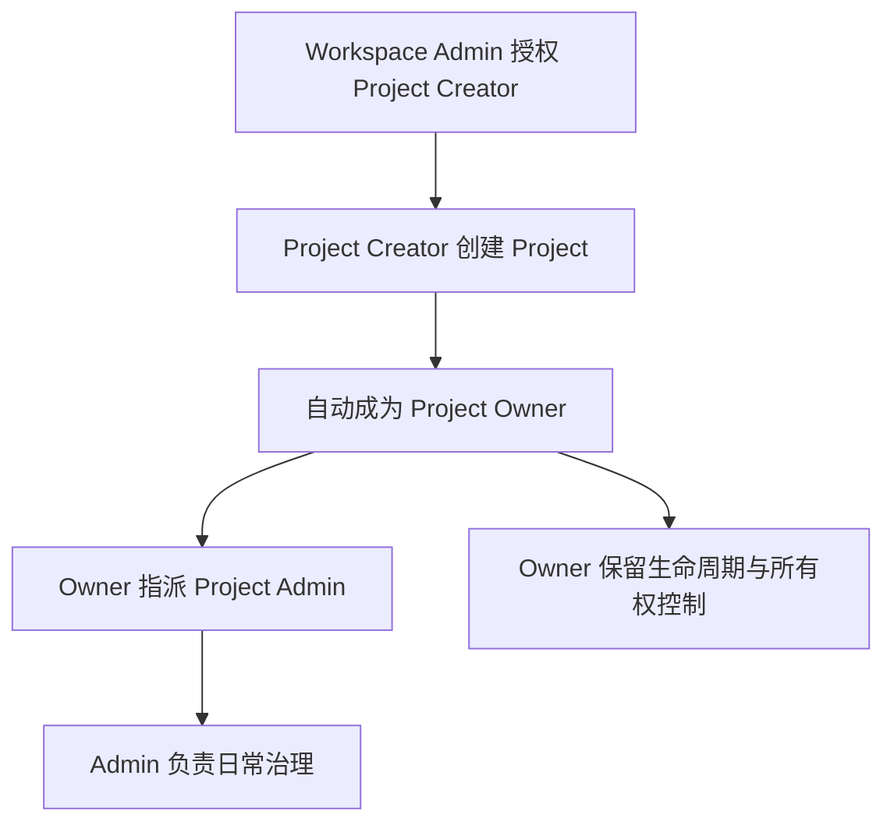

# 06. 工作区与项目治理 PRD

## 6.1 背景

对很多企业 AI 平台来说，真正难的并不是“建一个项目列表页”，而是回答以下问题：

1. 用户如何进入正确的 workspace 上下文。
2. 谁可以创建项目，谁应对项目负责。
3. 如何在不扩大高权限范围的情况下，让业务团队保持自治。
4. 如何让 owner、admin、member 的差异既能被用户理解，又能被系统稳定执行。

AgentSmith 在这一层的设计目标，不是做一套复杂的组织管理系统，而是构建一条清晰、克制、可执行的 `workspace -> project` 治理主线。

## 6.2 模块定位

本章覆盖以下产品面：

1. workspace 业务入口
2. workspace home 与 workspace settings
3. project 列表与项目创建
4. owner / admin / creator 的关系模型
5. 成员治理与项目设置

## 6.3 产品目标

### 6.3.1 业务目标

1. 让用户在清晰的 workspace 语境中进入业务面。
2. 让 workspace admin 与 project creator 协作完成项目创建。
3. 让 owner 与 admin 的权限边界清晰可执行。
4. 让项目治理围绕 permission token，而非角色名散落判断。

### 6.3.2 体验目标

1. 降低用户进入 workspace 与创建 project 的认知负担。
2. 不让用户必须理解系统内部角色实现才能完成关键动作。
3. 让高权限动作在视觉和流程上与普通治理动作分层。

## 6.4 用户与典型故事

### Workspace Admin

作为 workspace admin，我希望能够决定谁可以创建 project，并在必要时强制调整项目 owner，这样我可以维持工作区层面的治理秩序，而不必介入每个项目的日常细节。

### Project Creator

作为被授权的创建者，我希望在创建 project 后自动成为 owner，这样我能立即承担项目责任并开始组织团队协作。

### Project Owner

作为 project owner，我希望掌握项目生命周期、owner 转移和 project admin 指派权限，这样我能对项目承担最终责任，同时把日常治理委派出去。

### Project Admin

作为 project admin，我希望管理资源、策略、成员和日常治理事项，但不承担 owner 级的最终责任和生命周期权限，这样我的职责边界清晰且风险可控。

### Member

作为项目成员，我希望在明确的项目上下文里使用 AI 能力，而不需要理解复杂的治理结构，这样我可以专注完成工作。

## 6.5 工作区入口需求

### 6.5.1 为什么要先进入 workspace

AgentSmith 明确要求除 system admin 外，所有业务用户都必须先进入 workspace 语境，再进入业务登录。这样做的目的有三个：

1. 确保认证由 workspace 绑定的 IdP 提供。
2. 确保后续 project、resource、audit 都有明确租户边界。
3. 避免出现“先全局登录，再决定你属于哪个 workspace”的混乱流程。

### 6.5.2 需求清单

| 功能 | 需求说明 | 当前状态 |
|---|---|---|
| 公开 workspace 选择 | 用户先选 workspace，再登录 | `已实现` |
| 直接 workspace URL 访问 | 用户可直接进入 workspace 登录页 | `已实现` |
| workspace home | 作为项目导航与上下文确认页 | `已实现` |
| workspace overview 非大盘化 | 不承载虚假运营指标 | `已实现` |

### 6.5.3 产品要求

1. workspace home 的作用是“确认上下文并继续进入项目”，而不是展示伪运营看板。
2. workspace settings 的作用是治理入口，不应混入 system 级配置。
3. workspace overview 不应演化成没有真实后台支撑的综合仪表盘。

## 6.6 项目创建与生命周期

### 6.6.1 关键规则

1. workspace admin 可创建项目。
2. 被授权的 project creator 可创建项目。
3. project creator 创建项目后自动成为 owner。
4. owner 负责生命周期、owner 转让与 project admin 指派。
5. project admin 负责项目治理，但不拥有 lifecycle 权限。

### 6.6.2 关键任务流

### 6.6.3 当前状态

| 能力 | 当前状态 |
|---|---|
| workspace admin 创建项目 | `已实现` |
| project creator 创建项目 | `已实现` |
| 创建后自动成为 owner | `已实现` |
| owner transfer | `已实现` |
| 原 owner 自动保留为 admin | `已实现` |
| project admin 与 owner 权限分层 | `已实现` |

## 6.7 成员与治理边界

### 6.7.1 项目成员治理

当前项目具备以下治理能力：

1. 成员关系维护
2. join request 处理
3. project admin 指派
4. project owner 转移
5. 基于 permission 的页面门禁与操作门禁

### 6.7.2 边界要求

1. 成员来源由 workspace IdP 决定。
2. AgentSmith 不应演化成独立 HR/IM 身份系统。
3. 所有授权判断最终必须折叠成 permission token。
4. 角色标签只能作为权限派生来源，不能替代权限真相。

## 6.8 项目设置页需求

项目设置页应分成两类区域：

| 区域 | 说明 | 设计目的 |
|---|---|---|
| Ownership / Lifecycle | owner 转让、项目删除等高权限动作 | 突出高风险动作，降低误操作 |
| Governance | 项目基础配置、治理项、admin 组等 | 支撑日常治理与协作 |

这样设计的目的：

1. 强化 owner 与 admin 的职责差异。
2. 降低误操作风险。
3. 让治理操作与生命周期操作在 UX 上显式分层。

## 6.9 验收标准

### 功能验收

1. 用户必须先进入 workspace 语境，再进入业务登录。
2. workspace admin 可以授予或撤销 project 创建权限。
3. project creator 创建项目后自动成为 owner。
4. owner 可转让所有权、指派 admin。
5. project admin 不能执行 owner 专属动作。

### 体验验收

1. 用户能够理解自己当前处于哪个 workspace、哪个 project。
2. owner 与 admin 的差异必须在 UI 和动作上清晰可感知。
3. 不出现要求普通成员理解复杂治理结构才能完成日常任务的设计。

## 6.10 当前评估

### 已实现

1. 系统到 workspace 到 project 的主链路已重建。
2. project owner / admin / creator 的角色关系已落地。
3. workspace admin 与 project creator 的边界较清晰。
4. 多数核心模块已经从粗粒度 `project:manage` 迁移到更细的 permission。

### 需要继续完善

1. `project:manage` 仍有兼容残留，需要继续退出历史舞台。
2. 部分成员与治理页面仍需持续强化“权限真相优先”。
3. workspace 到 project 的 onboarding 引导可以进一步产品化。
