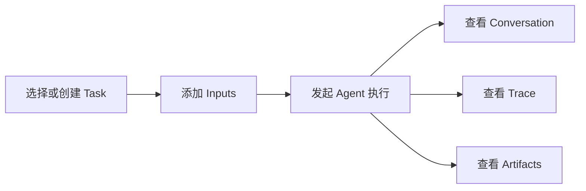
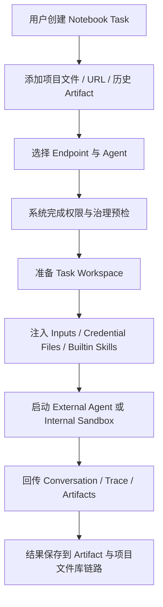
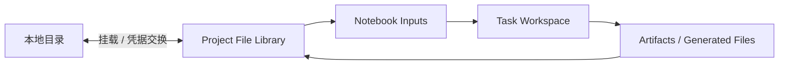

# 07. 核心使用面 PRD：Chat、Notebook、Files、Agents

## 7.1 Use 面的总体定位

Use 面是 AgentSmith 的用户生产力核心，负责把 endpoint、agent、files、inputs、artifacts 等能力组织成低心智、可执行、可追溯的使用体验。

它的产品目标不是“把多个页面放在一起”，而是把企业 AI 工作流中最常见的四类动作串成一条连续链路：

1. 发起对话
2. 组织任务
3. 使用文件与上下文
4. 驱动 agent 执行并沉淀产出

同时，Use 面还承担一个非常重要、但过去在文档里不够被强调的责任：

`把通用智能体从“难配置、难协作、不安全的命令行工具”，升级为“可被团队稳定使用的项目级工作能力”。`

## 7.1.1 目标用户

Use 面主要服务三类用户：

| 用户 | 核心目标 |
|---|---|
| 普通成员 | 快速使用 AI 能力完成日常任务 |
| 高阶知识工作者 | 在 Notebook 中组织更复杂的任务执行与产出 |
| 技术型用户/平台协作者 | 利用 agent、files、外部凭据和 skill 形成更复杂的自动化工作流 |

## 7.1.2 Use 面共性原则

1. 以项目上下文为主，不要求用户理解底层租户与协议细节。
2. 以结果和任务完成为中心，不把执行内部对象直接暴露给普通用户。
3. 每次执行都尽量可追踪、可回看、可复用。
4. Use 面虽然强调易用，但不能绕过治理链路。
5. 对通用智能体的接入，应尽量把复杂配置、环境准备和文件管理从用户侧抽走。

## 7.1.3 对通用智能体的产品承诺

如果 AgentSmith 要把 OpenClaw 一类通用智能体真正变成企业可用能力，那么 Use 面至少需要兑现以下承诺：

1. 用户可以在统一界面中发起任务，而不是必须学习命令行启动方式。
2. 任务输入可以直接来自项目文件库、URL 或历史 artifacts，而不是要求用户手工组织本地目录。
3. 运行过程中的 trace、conversation、artifacts 和失败原因都可以被回看。
4. 运行目录、凭据、skills 和文件落盘尽量由平台负责组织，而不是转嫁给最终用户。
5. 当系统尚未做到完全托管时，也必须诚实暴露“哪些能力已实现、哪些仍依赖基础设施”。

## 7.2 Chat

### 7.2.1 产品定位

项目内对话式 AI 使用面，支持基于 endpoint 或 external agent 的会话执行。

Chat 解决的是“快速开始”和“低门槛使用”的问题。它应该是用户进入项目后最自然的 AI 入口。

### 7.2.2 典型用户故事

作为项目成员，我希望在进入项目后就能快速选择可用的模型或 agent 发起对话，并在必要时附加图片或文件，而不用自己理解底层资源配置和执行协议。

### 7.2.3 已实现需求

| 能力 | 说明 |
|---|---|
| 会话线程管理 | 支持 active session、thread pane、无活动线程显式提示 |
| 绑定要求 | 发送前必须绑定 endpoint/model 或 external agent |
| 流式输出 | 通过 SSE 消费流式 delta / done / error |
| 附件支持 | 本地上传、文件库选择、拖拽、粘贴图片/文件 |
| 多模态前置校验 | 非多模态执行绑定下禁止附件发送 |
| 错误码映射 | 对 agent offline、timeout、protocol error 等给出稳定用户提示 |

### 7.2.4 产品要求

1. Chat 必须 result-first，发送链路必须明确。
2. 对普通用户，不暴露内部协议和复杂执行对象。
3. 对外部 agent 会话，应保持与 endpoint streaming 一致的消费模型。
4. 对无可用执行绑定的场景，要给出明确下一步动作，而不是无声失败。
5. 当附件不被当前执行绑定支持时，系统要明确解释原因。

### 7.2.5 权限与门禁

1. 进入 Chat 至少需要 `project:endpoint:use` 或等价可用的执行权限。
2. 若用户缺少执行绑定所需能力，不应允许进入“可发送但必失败”的状态。
3. 管理 agent 的能力必须与使用 agent 的能力区分。

### 7.2.6 状态与错误处理

#### 关键状态

1. 无活动线程
2. 已绑定 endpoint/model
3. 已绑定 external agent
4. 正在流式生成
5. 等待中 / pending
6. 附件不可用

#### 错误处理要求

1. `AGENT_OFFLINE` 必须给出明确重连或重试提示。
2. `AGENT_PROTOCOL_ERROR` 必须被视为实现级错误，而不是普通网络抖动。
3. 图片无法转为 data URL 时，必须前置失败而不是让用户等待无意义请求。

## 7.3 Notebook

### 7.3.1 产品定位

任务式智能体工作流模块，围绕输入、对话过程、artifact 产出组织执行体验。

Notebook 解决的问题不是“再做一个 Chat”，而是把更长链路、更强上下文、更可复用的 AI 工作流沉淀下来。

对通用智能体来说，Notebook 还有另一个同样重要的产品意义：

`它是统一的智能体操作界面。`

它把原本分散在命令行、目录结构、脚本、临时文件和终端输出里的执行过程，重新组织成：

1. 一个 task
2. 一组 inputs
3. 一段可回看的 conversation
4. 一条可诊断的 trace
5. 一组可复用的 artifacts

### 7.3.2 典型用户故事

作为需要完成复杂分析、内容生产或工程辅助任务的用户，我希望把文件、URL、历史 artifact 等输入组织成一个任务，让 agent 在一个可追踪、可回看、可复用的上下文里执行，并输出结构化结果。

作为希望使用 OpenClaw 一类通用智能体的用户，我希望不必手工搭建复杂运行目录、复制文件、配置大量本地脚本和不受控凭据，而是直接在 Notebook 中发起任务、挂接输入、查看执行和保存产物。

### 7.3.3 关键交互

### 7.3.3A 通用智能体运行任务流

从产品视角，一个通用智能体在 Notebook 中的理想运行链路应当是：

这个任务流的意义是，它把原本分散的：

1. 本地目录准备
2. 凭据文件注入
3. skill 安装
4. 结果查找
5. 执行故障排查

统一收敛成一个项目内可回看的任务对象。

### 7.3.4 已实现需求

| 能力 | 说明 | 当前状态 |
|---|---|---|
| Task 列表与详情 | list/detail 双页面模型 | `已实现` |
| 三栏布局 | Inputs / Conversation / Artifacts | `已实现` |
| 输入来源 | Files、Local Upload、URL | `已实现` |
| Trace 展示 | timeline/raw 双视图、懒加载 traces | `已实现` |
| Artifact 产出 | text/image/file/other | `已实现` |
| Task SSE | 实时 trace_event 推送 | `已实现` |
| Terminal trace fallback | 防止永远空 trace 时间线 | `已实现` |

### 7.3.5 产品要求

1. Notebook 的核心对象应始终是 `Task`、`Inputs`、`Conversation`、`Artifacts`、`Trace`。
2. Trace 需要服务于诊断和回溯，但默认体验仍应结果优先。
3. Inputs 的来源必须清晰，不要求用户手工拼接上下文。
4. Artifact 应能成为后续任务和协作的再输入。
5. Notebook 应尽可能承担“统一 agent 交互界面”的职责，而不是把用户赶回命令行。
6. 对通用智能体来说，Notebook 应把运行环境、文件输入输出和结果沉淀统一到同一个工作流里。

### 7.3.6 更细功能分解

| 能力单元 | 说明 | 当前状态 |
|---|---|---|
| Task 列表 | 创建、浏览、切换任务 | `已实现` |
| Task 详情页 | 三栏布局承载 inputs/conversation/artifacts | `已实现` |
| Inputs 管理 | Files、Local Upload、URL 等来源接入 | `已实现` |
| 执行 trace | timeline/raw 双视图与分页加载 | `已实现` |
| Artifact 产出 | 多类型结果展示与回看 | `已实现` |
| Internal sandbox hint | 托管执行启动状态提示 | `已实现` |

### 7.3.6A 运行时资产模型

结合当前 runner 与 execution contract，Notebook 已经具备较明确的运行时资产模型：

| 资产 | 产品含义 | 当前情况 |
|---|---|---|
| Task Workspace | 单次任务的执行工作目录 | `已实现` |
| Task Inputs Manifest | 任务输入来源清单，支持 library object / artifact / URL | `已实现` |
| Credential Files | 每次请求注入的第三方凭据文件 | `已实现` |
| Builtin Skills Mount | 自动挂载到 `./.codex/skills/` 的技能目录 | `已实现` |
| Artifacts Directory | 任务产物目录，runner 扫描并回传 | `已实现` |
| Sandbox-backed Runtime | 托管型执行环境 | `部分实现` |

这说明 Notebook 已经不是“前端任务页”，而是带有明确运行时对象模型的统一任务执行界面。

### 7.3.7 权限与门禁

1. 进入 Notebook 至少需要 `project:endpoint:use`。
2. 若用户不能访问目标 endpoint，则任务执行必须在 preflight 被阻断。
3. 若目标 agent 不可用，则必须明确终止，而不是产生悬空任务执行状态。

### 7.3.8 状态与错误处理

#### 关键状态

1. Task 空列表
2. Task 有上下文但未执行
3. 正在执行
4. sandbox starting
5. 执行完成
6. 执行失败

#### 错误处理要求

1. 任务执行在开始前失败时，仍需生成最小 terminal trace，避免空时间线。
2. sandbox 未配置时，必须返回明确错误码而不是模糊失败。
3. endpoint governance preflight 失败时，应让用户理解是“权限/限制问题”，不是“系统故障”。

### 7.3.8A 异常与失败场景

对于通用智能体任务，至少要覆盖以下失败语义：

| 场景 | 用户应看到什么 | 产品要求 |
|---|---|---|
| 无可用 endpoint | 明确的资源不可用提示 | 不允许进入假可运行状态 |
| 无可用 agent | 明确提示未绑定或 agent offline | 提供下一步动作指引 |
| sandbox manager 未配置 | 明确说明托管执行不可用 | 不可伪装为普通执行失败 |
| 输入文件不可读 | 指出是输入侧问题 | Trace 中保留定位信息 |
| agent 协议错误 | 明确标记为 agent 实现问题 | 与普通网络错误区分 |
| 无 artifact 产出 | 应有最小可解释结果 | 至少保留 terminal trace 或最终响应 |

### 7.3.8B 模块级验收标准

Notebook 作为“统一智能体操作界面”，阶段性验收至少包括：

1. 用户可以仅通过 Web 界面创建任务、选择输入并发起一次完整执行。
2. 任务执行前的权限、endpoint、agent 可用性检查结果可被用户理解。
3. 任务运行过程中至少能看到 conversation、trace 或 sandbox 状态中的一种实时反馈。
4. 任务结束后，文字结论和产物文件都能以标准对象被回看。
5. 当执行失败时，用户能够区分是配置问题、治理问题、运行环境问题还是 agent 本身问题。

### 7.3.9 内部 agent 托管执行

当前 Notebook 已支持两类 agent 执行路径：

1. `external agent`
2. `internal agent`（经 sandbox manager + pod manager 托管）

其中 internal agent 当前状态为：`部分实现`

说明：

1. 系统已经具备 `sandbox_starting` 事件、pod ensure、keepalive、release 逻辑。
2. 当未配置 sandbox manager 时，链路会明确 fail-fast。
3. 这说明内部托管执行路径已经进入产品设计与接口层，但仍依赖外部基础设施配置。

这条能力线的产品价值在于：

1. 让通用智能体不必直接运行在不受控宿主环境中
2. 让 agent 执行环境可以被平台托管和回收
3. 让企业能够在“更安全、更稳定”的前提下开放智能体能力

## 7.4 Files

### 7.4.1 产品定位

项目级文件库管理模块。文件库是项目的一等资源，一个 file library 映射一个 JuiceFS 文件系统。

Files 的意义不只是“上传附件”，而是为项目提供一个长期可复用的上下文资产空间，让 Chat、Notebook、Agent 和本地工作流连接起来。

对于通用智能体运行来说，Files 还承担两个非常关键的角色：

1. 作为 Notebook / Agent 的输入来源
2. 作为运行期工作文件和产出文件的持久化落点

### 7.4.2 典型用户故事

作为项目成员，我希望把资料、数据、生成结果和中间文件保存在项目文件库中，并能在 Web 与本地环境之间同步使用，这样团队协作和 agent 工作流都能围绕同一批文件展开。

作为运行通用智能体的用户，我希望本地文件系统与 AgentSmith 文件库之间能够无缝衔接，这样我就不必在“本地目录”和“平台文件”之间反复手工拷贝，也不必担心运行结果丢失。

### 7.4.3 已实现需求

| 能力 | 当前状态 |
|---|---|
| File library CRUD | `已实现` |
| 浏览目录与文件 | `已实现` |
| 上传/下载 | `已实现` |
| rename/move/delete | `已实现` |
| 批量选择 | `已实现` |
| 运行状态展示 | `已实现` |
| 本地挂载说明 | `已实现` |
| mount access / credential exchange | `已实现` |

### 7.4.4 产品要求

1. 文件库列表必须是入口，不应把用户直接扔进复杂的存储概念里。
2. 选中某个文件库后，文件浏览器应成为主工作面。
3. 本地挂载与 Web 操作应被视为同一资源的不同访问方式。
4. 非空文件库删除必须谨慎，默认 fail-fast。
5. 面向通用智能体的运行文件系统，应支持与项目文件库形成自然衔接，而不是让运行过程变成一次性临时目录黑盒。

### 7.4.4A 文件库与运行文件系统关系

从通用智能体产品体验看，Files 不是一个独立于执行系统的附件页，而应被理解为运行文件系统的持久化锚点。

理想关系如下：

这条链路强调：

1. 文件不应在“上传后就与执行脱节”。
2. 运行目录不应在“执行结束后就不可见”。
3. 任务结果应尽量回流到项目文件库，而不是停留在黑盒目录。

### 7.4.5 权限与门禁

1. 浏览和下载至少需要项目内相应读权限。
2. 上传、删除、重命名、移动等写操作必须受更高权限控制。
3. mount access 和 credential exchange 行为应被视为高敏感动作并纳入审计。

### 7.4.6 状态与错误处理

#### 关键状态

1. creating
2. ready
3. degraded
4. failed
5. deleting

#### 错误处理要求

1. 非空文件库删除必须 fail-fast，并清楚告知原因。
2. degraded/failed 状态必须在 UI 中显式暴露，不允许伪装成普通列表项。
3. 文件浏览局部失败时，应尽量保持当前上下文，不把用户弹回列表首页。

### 7.4.6A 模块级验收标准

1. 用户可以在 Web 中浏览、上传、下载和管理项目文件。
2. 用户能够获得本地挂载说明和必要的 credential exchange 支持。
3. Notebook 任务可以消费来自文件库的输入对象。
4. 任务生成的产物可以被再次查看、下载或用于后续任务。
5. 对用户而言，“项目文件”和“任务结果文件”应当属于同一套可理解的项目资产体系。

### 7.4.7 目标架构要求

每个 file library 应具备独立的：

1. PostgreSQL metadata database
2. MinIO bucket
3. backend credential
4. gateway process

当前状态判断：`部分实现`

原因：

1. 产品合同和真实测试路径已明确这个目标。
2. 仓库也存在 real-lane smoke 与 sync 校验。
3. 但 PRD 仍应把其视为“已成体系、持续增强”的能力线，而非已经结束演进。

## 7.5 Agents

### 7.5.1 产品定位

项目内 agent 资源管理模块，支持 external agent 与 internal agent 两类运行模式。

它的核心价值是把 agent 从“某个散落的外部程序”提升为项目中的正式资源对象。

对于通用智能体场景，这个模块还在解决一个更大的问题：

`如何把 OpenClaw 一类强大但不易配置、默认不够安全、也不适合广泛协作的智能体，变成企业里可用的项目级能力。`

### 7.5.2 典型用户故事

作为技术型用户或平台协作者，我希望把一个 agent 明确注册到项目中，并让 Chat 或 Notebook 能稳定地调用它、观测它的执行过程、接收它的 artifacts，这样 agent 不再是黑盒工具，而是平台内的一等执行节点。

作为平台建设者，我希望通用智能体的启动、配置、凭据注入、工作目录和文件落盘都尽量被 AgentSmith 托管，这样团队不需要每个人都成为底层运行环境专家。

### 7.5.3 已实现能力

| 能力 | 说明 |
|---|---|
| Agent 资源管理 | agent 列表、详情、状态元信息 |
| Agent service key | 获取/创建/删除 agent key |
| WebSocket 执行通道 | `/api/v1/agent-execution/ws?agent_id=...` |
| 单 agent 单活连接 | 新连接替换旧连接 |
| Trace / Artifact 协议 | 结构化 event 与 artifact 协议已定义 |

### 7.5.4 权限与门禁

1. agent 管理与 agent 使用能力必须分离。
2. 获取或删除 agent service key 必须视为高敏感动作。
3. external agent 与 internal agent 的模式差异应主要体现在配置与运行反馈上，而不是让普通用户承担理解成本。

### 7.5.5 状态与错误处理

#### 关键状态

1. enabled / disabled
2. online / offline
3. internal sandbox not configured
4. sandbox starting
5. upstream/protocol error

#### 错误处理要求

1. 单 agent 单活连接语义必须稳定，重复连接应替换旧连接而不是形成模糊状态。
2. protocol 级错误必须可追踪到 agent 实现问题。
3. internal sandbox 失败必须尽量映射成明确的产品错误语义。

### 7.5.6 运行环境要求

对通用智能体运行环境，AgentSmith 的目标要求应包括：

1. 运行目录可控
2. 文件输入输出可接入项目文件库
3. 凭据注入有明确边界
4. 产出文件可持久化
5. sandbox 路径与非 sandbox 路径的失败语义清晰

### 7.5.6A Agent 运行模式的产品边界

当前产品需要同时支持两类现实：

| 运行模式 | 产品意义 | 当前判断 |
|---|---|---|
| External Agent | 兼容已有 agent 进程与外部接入方 | `已实现` |
| Internal Agent + Sandbox | 让平台逐步掌握启动、保活、回收和隔离 | `部分实现` |

这意味着 PRD 需要明确一个边界：

AgentSmith 当前已经可以把通用智能体纳入统一入口和协议体系，但“完全托管、完全隔离、完全持久化”的最终形态仍在建设中。

### 7.5.6B 模块级验收标准

1. 项目内可以注册、查看和区分不同类型的 agents。
2. Chat 或 Notebook 可以通过统一协议调用 agent 并接收 trace / artifacts。
3. service key 等高敏感动作与普通使用权限分离。
4. internal agent 在基础设施具备时可以进入托管执行路径。
5. 当 internal sandbox 不可用时，系统能明确暴露这一事实，而不是让用户误判为普通任务失败。

### 7.5.7 Builtin Skills

当前已存在仓库托管的 builtin skills：

1. `.system`
2. `feishu-docs`
3. `jira-ops`
4. `file-read`

Runner 会自动将这些技能挂载到任务工作区的 `./.codex/skills/`。

这说明：

1. AgentSmith 已经拥有 skill 注入机制。
2. Skill 生态不是空白规划，而是已有基础设施。

### 7.5.8 对 OpenClaw 一类智能体的现实意义

对 OpenClaw 一类通用智能体来说，真正困难的常常不是模型能力本身，而是：

1. 输入文件如何组织
2. 技能如何装配
3. 凭据如何注入
4. 运行目录如何管理
5. 结果文件如何保存

AgentSmith 当前已经在 `Notebook + Files + Agents + Skills + Sandbox` 这条链路上形成了明显方向，这正是它区别于普通“agent 展示页”或“模型调用面板”的地方。

## 7.6 第三方账户与凭据

虽然不属于项目 Use 面主导航，但它直接支撑 toolchain 与 agent 执行：

1. 用户可管理 user-scoped external identities、tokens、SSH credentials。
2. 支持 Feishu OAuth。
3. 为后续 MCP 与更多 skill 集成提供凭据基础。

当前状态：`已实现`

## 7.7 本章结论

Use 面的真正竞争力不在于“模块多”，而在于它已经把四类关键对象连接起来：

1. `Resource`
2. `Execution`
3. `Context`
4. `Output`

这使 AgentSmith 不只是一个 AI 聊天工具集合，而是：

1. 一个可以承接真实工作流的项目级 AI 使用平台
2. 一个让通用智能体变得更易用、更安全、更可协作的统一运行界面

## 7.8 异常场景、依赖与开放问题

### 7.8.1 典型异常场景

1. Chat 没有可用 endpoint 或 agent 绑定
2. Notebook 任务执行前治理 preflight 失败
3. internal agent sandbox 未配置或启动失败
4. Files 文件库处于 degraded / failed 状态
5. agent 在线状态与用户发起执行的时机错位

### 7.8.2 外部依赖

1. endpoint 资源可用性
2. external agent 在线连接
3. sandbox manager 与 K8s 环境
4. MinIO / PostgreSQL / JuiceFS 等文件库基础设施
5. 用户第三方凭据和 skill runtime 所需工具链

### 7.8.3 当前开放问题

1. internal agent 何时能成为默认可信执行路径
2. artifact 的跨任务复用策略是否需要更强产品化
3. skill 使用体验是否需要从隐式能力转向更可见的产品对象

## 7.9 模块级验收标准

### Chat

1. 无线程、绑定缺失、流式中、失败态都能被清晰区分。
2. external agent 错误码映射稳定。
3. 非多模态绑定下附件入口被正确收敛。

### Notebook

1. task 创建、执行、trace、artifact 主链路可跑通。
2. 无 trace 帧情况下仍可看到 terminal trace。
3. sandbox 启动中状态可见。

### Files

1. 文件库 CRUD 与浏览链路可跑通。
2. degraded/failed 状态可见。
3. 本地挂载说明与 exchange 动作可达。

### Agents

1. agent 管理、key 管理、连接状态展示可用。
2. external agent 执行协议链路可用。
3. internal agent 未配置时 fail-fast。
