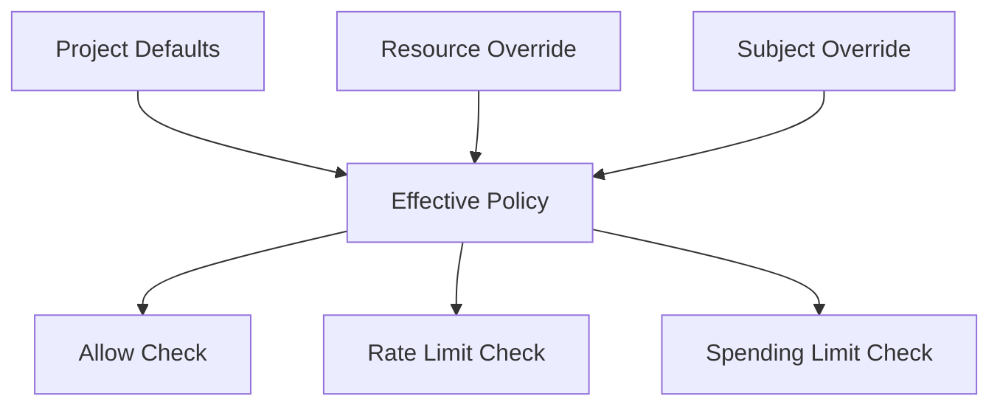

# 08. 治理面 PRD：Endpoints、Resource Policy、Credentials、Members、Usage、Audit、Alerts

## 8.1 治理面的总体定位

治理面是 AgentSmith 的项目级控制和证据中心，核心目标是让管理员能够配置资源、约束使用、管理成员、查看证据并完成审查。

如果说 Use 面解决的是“把 AI 用起来”，那么 Govern 面解决的是“把 AI 用得可控、可解释、可持续”。

Govern 面的设计必须避免两种极端：

1. 太轻，导致产品只是一个没有治理能力的使用壳层
2. 太重，演化成复杂、抽象、难懂的管理后台

因此，当前治理面的产品原则是：

1. 只围绕项目级主线展开
2. 只暴露用户真正需要理解的对象
3. 所有治理动作都尽量形成证据链

## 8.1.1 核心用户

| 用户 | 目标 |
|---|---|
| Project Owner | 对项目承担最终治理责任 |
| Project Admin | 完成资源、策略、成员、审查等日常治理 |
| 普通成员 | 查看自己的 usage，不参与复杂治理判断 |

## 8.2 Endpoints

### 需求定位

管理项目可用的模型 endpoint，是当前治理主线的核心资源对象。

### 典型用户故事

作为项目管理员，我希望在项目中统一配置可用模型 endpoint，并保证后续 Chat、Notebook 与 API 路径都围绕这套 endpoint 运行，这样我可以控制资源来源、能力边界和成本约束。

### 已实现

1. endpoint 列表与 CRUD
2. capability-first 的 provider/model 选择
3. import/export
4. endpoint capability 语义保持
5. Chat 仅展示 completion-capable endpoint

### 权限与门禁

1. endpoint 读取需要具备使用或治理相关权限。
2. endpoint 变更需要 `project:governance:update`。
3. endpoint 配置错误不应在使用路径被静默吞掉，而应在治理面尽量提前暴露。

### 状态与错误处理

1. 创建/更新 payload 不合法时应 fail-fast。
2. provider/model 选择与 capability 不匹配时，应在表单层阻断。
3. 导入/导出失败时应给出足够清晰的错误摘要。

### 规划增强

1. 与 model catalog 的版本化与激活流程更紧密联动
2. 更完整的价格、能力、来源元数据展示

## 8.3 Resource Policy

### 需求定位

围绕 `endpoint` 资源定义访问控制与 rate/spending 限制。

### 典型用户故事

作为项目管理员，我希望能为某个 endpoint 配置默认限制、资源覆盖和用户覆盖，这样我可以在不改变整体项目结构的情况下，对高价值资源进行精细治理。

### 当前治理模型

### 已实现

1. 仅对 `endpoint` 资源生效
2. 支持 project default / resource override / subject override
3. 支持 policy change history
4. 支持 explainability 与 stale detection

### 产品要求

1. 管理员必须能理解一条有效策略是如何被解析出来的。
2. 同一资源上存在多个覆盖层时，界面应尽量解释优先级，而不是只显示结果。
3. 治理结果需要能在使用路径上被真正执行，而不是停留在配置层。

### 当前边界

1. `agent` 策略管理在合同中仍属于 MVP 外
2. 不做跨 project 的模板中心

### 权限与门禁

1. resource policy 读写仅对具备治理权限的用户开放。
2. 普通成员不应看到会误导其理解系统内部策略结构的编辑能力。

### 状态与错误处理

1. allow_list 模式下若无有效 subject，应视为无效配置。
2. override 冲突不应只在保存后暴露，能前置解释时尽量前置。
3. 若策略无法在使用路径被执行，则应被视为严重产品缺陷。

## 8.4 Credentials

### 定位

项目级凭据与连接配置治理模块。

### 典型用户故事

作为项目管理员，我希望把访问第三方服务或模型资源所需的项目级凭据集中管理，并在需要时明确其归属和用途，这样我可以降低散落凭据带来的安全与维护成本。

### 已实现

1. 凭据管理页面与交互
2. 配套权限门禁
3. 与 endpoint / resource 治理链路配合

### 风险

当前部分 secret handling 仍属于 MVP 级别，并非最终安全姿态。

### 权限与门禁

1. 凭据模块仅对具备治理权限的用户开放。
2. secret 明文展示必须被严格限制。

### 状态与错误处理

1. 凭据无效、过期或不可访问时，应区分“配置存在但不可用”和“根本不存在”。
2. 删除或替换凭据时，应避免影响范围不透明。

## 8.5 Members

### 定位

成员、管理员、加入请求和权限授予的项目级治理模块。

### 典型用户故事

作为项目 owner 或 admin，我希望能够管理项目成员、处理加入请求，并明确区分 owner 与 admin 的权限边界，这样项目治理既不会过度中心化，也不会失控。

### 已实现

1. 成员治理主链路
2. join request
3. project admin 管理
4. 与 owner/admin 权限分层对齐

### 权限与门禁

1. owner、admin、member 的操作面必须清晰分层。
2. 成员治理动作必须基于 permission，而不是基于页面文案中的角色名判断。

### 状态与错误处理

1. 加入请求的待处理、已通过、已拒绝状态需要可区分。
2. owner 级动作若被 admin 尝试触发，必须明确禁止原因。

## 8.6 Usage

### 产品目标

回答用户三个问题：

1. 我在用哪些资源？
2. 我的 rate / spending 消耗到了什么程度？
3. 哪些窗口快达到限制？

### 典型用户故事

作为普通成员，我希望能看到自己在当前项目中各资源的使用进度和剩余额度，这样我可以预判是否需要调整使用方式，而不必等到请求被拒绝才知道超限。

### 已实现

1. 个人视角使用量展示
2. limit summary
3. 趋势图与资源切换

### 强边界

1. 不做管理员排障
2. 不做复杂分析模式
3. 不做跨资源总量大盘

### 状态与错误处理

1. 空数据、接近上限、已命中限制三种状态应明确区分。
2. 使用量展示不应把治理诊断信息强塞给普通用户。

## 8.7 Audit

### 产品目标

回答管理员四个问题：

1. 最近发生了什么变化？
2. 谁改了什么？
3. 哪些资源有异常？
4. 需要进一步去哪里处理？

### 典型用户故事

作为项目管理员，我希望在一个相对统一的视图中看到最近发生的资源变更、异常事件、限制命中和关键治理动作，并能按资源、时间、操作人进行筛选，这样我可以快速完成排查和治理判断。

### 已实现

1. 审计主表与详情抽屉
2. 基础筛选
3. 配置变更、异常事件、关键治理记录
4. policy / usage / project 治理事件的证据记录

### 当前判断

Audit 已经是当前 MVP 中承接“原 Runtime 可见内容”的主要收口点。

### 权限与门禁

1. Audit 至少需要 `project:audit:read`。
2. 普通成员默认不应进入管理员审计视图。

### 状态与错误处理

1. 审计记录为空时，应解释为“暂无记录”而不是“系统出错”。
2. 详情数据缺失时，应尽量保留主事件上下文，不让用户丢失定位线索。

## 8.8 Alerts

### 定位

项目级治理信号与热点提醒模块。

### 典型用户故事

作为管理员，我希望系统能把高优先级的治理信号集中呈现出来，例如异常热点、策略风险或资源问题，这样我无需从大量 Audit 记录中手工筛出最值得关注的事项。

### 当前状态

`已实现`

但边界必须克制：

1. Alerts 是治理信号，不是发布/运维流水线。
2. 它服务于证据与热点提示，不应膨胀成告警编排系统。

### 状态与错误处理

1. alerts 为空不应制造噪音。
2. 高优先级热点必须与后续可查看的治理证据关联。

## 8.9 Model Catalog 与 Project Pricing

这条能力线非常重要，虽然不是单独导航模块，但会深度影响 endpoint 管理。

### 已实现基础

1. 服务启动时进行 model catalog bootstrap
2. 已有 model catalog / project pricing contract
3. 存在 model config store、route handler、sync 工具链

### 当前状态判断

`部分实现`

原因：

1. 合同已完整描述目标态。
2. 代码中已有 bootstrap 与存储实现。
3. 但“版本切换、回滚、完整审计化管理”仍应视为建设中能力。

## 8.10 本章结论

当前治理面的产品价值已经比较清楚：

1. 它不是纯后台配置页集合。
2. 它围绕 endpoint 资源、成员边界、策略约束与证据链形成了一套统一治理结构。
3. 它为 AgentSmith 提供了“可控”这一层真正的产品护城河。

## 8.11 异常场景、依赖与开放问题

### 8.11.1 典型异常场景

1. endpoint 存在但 capability 与实际上游能力不一致
2. resource policy 配置存在冲突或理解歧义
3. 成员拥有使用权限但缺失治理权限
4. usage 数据可见但用户难以理解 limit 命中原因
5. audit 记录存在，但证据粒度不足以支撑排查

### 8.11.2 外部依赖

1. 模型目录数据源和 catalog bootstrap 机制
2. 上游模型服务与 endpoint 可用性
3. policy 执行与 usage/audit 记录写入链路
4. 身份目录与成员来源的稳定性

### 8.11.3 当前开放问题

1. model catalog 何时升级为更完整的版本化运营能力
2. resource policy 是否在未来扩展到 agent 等更多资源对象
3. usage 与 audit 是否需要更强的 explainability 关联视图

## 8.12 模块级验收标准

### Endpoints

1. endpoint CRUD、导入导出主链路可用。
2. capability 与 provider/model 选择关系正确。
3. 无效配置能前置失败。

### Resource Policy

1. default / resource / subject 三层覆盖能正确表达。
2. policy history 可查看。
3. 使用路径上的策略执行结果与配置一致。

### Credentials

1. 凭据读写受治理权限控制。
2. 敏感字段不会被不当暴露。

### Members

1. 成员治理、join request、admin 管理可用。
2. owner/admin 权限边界可验证。

### Usage

1. 用户能看清自己的使用进度与剩余空间。
2. 不引入管理员分析负担。

### Audit / Alerts

1. 最近事件、异常、关键治理动作可查看。
2. 筛选与详情链路可用。
3. alerts 能与治理证据形成联动。
