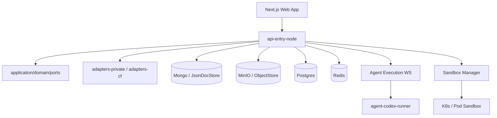
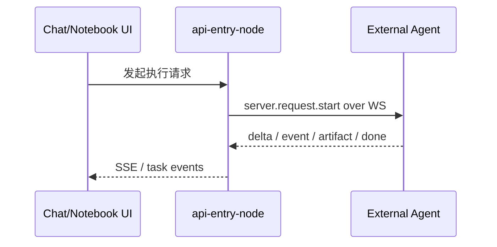
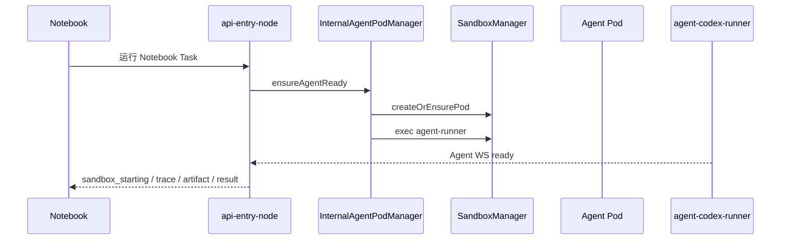
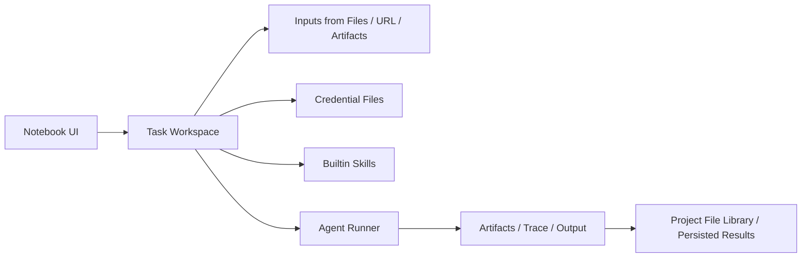

# 09. 技术架构、模块分层与关键运行链路

## 9.1 本章目的

这章不是为了把所有技术细节都写成实现说明书，而是为了回答产品协作中最重要的几个架构问题：

1. AgentSmith 为什么能同时承接 Use 面和 Govern 面。
2. 系统如何把前端体验、权限、资源、执行协议和证据链连接起来。
3. 当前架构哪些部分已经稳定，哪些部分仍在向目标态演进。

## 9.2 总体架构概览

这套结构的关键价值不在于“技术栈新不新”，而在于职责分层比较清楚：

1. 前端承载产品界面和交互状态
2. API 入口层负责鉴权、路由、协议编排
3. 应用层与领域层承接核心业务规则
4. adapters 负责基础设施适配
5. runner 负责把 agent 请求真正执行出去

## 9.3 架构设计原则

### 9.3.1 后端是唯一权威

权限、策略执行、资源可用性与执行路由的最终真相都在后端。

这意味着：

1. 前端 permission gate 是 UX 优化，不是安全边界
2. 后端必须独立校验 token、permission、resource policy
3. 所有关键错误都必须有稳定错误码

### 9.3.2 项目级统一约束

架构并没有为 Chat、Notebook、API 分别造三套治理链路，而是试图让它们共同接入 `endpoint-centric governance path`。

这样做的收益是：

1. 治理模型更统一
2. usage / audit 证据更容易对齐
3. 后续扩展成本更低

### 9.3.3 执行链路可协议化

Agent 执行不是黑盒调用，而是通过明确的 WS 协议和结构化事件回传实现的。这为 trace、artifact、错误映射和 future sandbox 托管提供了基础。

### 9.3.4 运行环境应平台化

AgentSmith 的一个关键技术目标，不只是“让 agent 跑起来”，而是让通用智能体运行环境逐步平台化。

这意味着：

1. 用户不再直接依赖本地不受控目录来运行智能体
2. 输入、输出、artifact 和工作目录逐步与项目上下文绑定
3. sandbox、文件系统、凭据和技能挂载被纳入统一控制

## 9.4 仓库分层

| 层 | 包/目录 | 职责 |
|---|---|---|
| 前端应用层 | `src/app`、`src/components`、`src/lib` | 页面、组件、前端状态与 API 调用 |
| API 入口层 | `packages/api-entry-node` | HTTP/WS 请求编排、鉴权、路由分发 |
| 应用层 | `packages/application` | 用例编排 |
| 领域层 | `packages/domain` | 领域对象与规则 |
| 端口层 | `packages/ports` | 抽象接口 |
| 适配器层 | `packages/adapters-private`、`packages/adapters-cf` | 存储与基础设施适配 |
| Runner 层 | `packages/agent-codex-runner` | 执行 agent 请求、挂载 skills、产出 trace/artifacts |

## 9.5 API 入口层职责

### 9.5.1 `index.ts`

职责：

1. 启动 HTTP server
2. 管理生命周期
3. 分发 WebSocket upgrade
4. 初始化 model catalog bootstrap
5. 启动 Feishu refresh runner

### 9.5.2 `request-handler.ts`

职责：

1. Bearer token 校验
2. 统一路由匹配
3. 项目级权限判断
4. 分发到 project/chat/agent/task/model-config/endpoint handler
5. 统一错误映射

产品意义：

这层把“很多模块”收束成“一个统一入口规则”，保证系统不会因为模块增多而失去一致性。

## 9.6 Agent 执行链路

### 9.6.1 External Agent

### 9.6.2 Internal Agent

### 9.6.3 架构判断

当前 external agent 路径已经比较成熟，internal agent 路径则处于“骨架已清晰、基础设施能力待补强”的阶段。

## 9.7 Notebook 执行链路关键点

1. Notebook run 会先校验 agent、endpoint、权限与治理 preflight。
2. 对 internal agent，会先触发 sandbox ensure。
3. 执行上下文中会注入：
   - workspace_id
   - project_id
   - task_id
   - run_id
   - endpoint_id
   - user bearer token
   - task_inputs
   - credential_files
4. runner 执行后回传 delta、trace_event、artifact、done/error。
5. 后端会写入 audit、usage、trace、task metrics。

这条链路的重要意义在于：

1. Notebook 不只是前端任务容器
2. 它已经具备接入真实执行环境的标准上下文模型
3. 这为未来 sandbox 托管与 skill runtime 扩展奠定了结构基础
4. 它把通用智能体运行从“手工命令行工作流”改造成“项目级统一操作界面”

## 9.8 通用智能体运行环境架构

从产品能力看，AgentSmith 当前已经具备一条非常重要的演进主线：

这条链路的意义在于：

1. Notebook 提供统一用户入口
2. task workspace 提供任务级运行目录
3. files / inputs / artifacts 提供上下文输入
4. credential files 和 skills 提供执行增强能力
5. 结果能够回流到平台，而不是散落在用户本地

### 9.8.1 本地文件系统与项目文件库衔接

从产品目标出发，AgentSmith 正在解决一个很现实的问题：

`如何让本地文件系统与平台文件库之间形成无缝协作，而不是彼此割裂。`

当前基础包括：

1. 文件库支持本地挂载说明与 credential exchange
2. Notebook 与 Files 已建立输入/产出联动
3. artifact 可以成为后续任务输入

这使平台具备了“把通用智能体运行文件系统逐步持久化和项目化”的基础。

### 9.8.2 持久化运行文件系统的产品意义

对通用智能体来说，运行目录如果只是一次性 `/tmp`，会带来明显问题：

1. 上下文难以复用
2. 产出难以沉淀
3. 团队协作困难
4. 运行后结果容易丢失

因此，AgentSmith 的重要价值之一，是让运行文件系统逐步与项目文件库和 artifact 体系形成持久化关系。

## 9.9 Skill 机制架构

当前 runner 已支持：

1. 从仓库目录读取 builtin skills
2. 将 skills 自动复制到任务工作区 `./.codex/skills/`
3. 按环境变量决定 required / optional

这意味着未来兼容更多 skill 来源时，现有架构的扩展点已经存在：

1. skill source registry
2. skill package format compatibility
3. skill trust / mount policy

这也是为什么 “OpenClaw SkillHub 兼容” 在产品规划上是合理的，而不是完全重新发明一套机制。

## 9.10 Workspace Provisioning 架构

当前已形成如下闭环骨架：

1. system UI 保存 workspace registry
2. publish 时调用 `initializeWorkspaceResources`
3. 初始化器调用 `initializeWorkspaceFoundations`
4. foundations 会按 domain 物化 collection 标记
5. provisioning artifact 写入磁盘

当前 domain 已覆盖：

1. model_config
2. endpoints
3. chat
4. agents
5. audit_usage
6. notebook
7. governance

这说明 workspace foundation 初始化并不是空白，而是已经有明确定义的物化域模型。

## 9.11 当前架构成熟度判断

### 已相对稳定

1. 前端产品结构与模块边界
2. API 入口层编排方式
3. external agent 执行协议
4. Notebook trace / artifact 结构化机制
5. builtin skills 自动挂载机制

### 仍在收敛

1. workspace provisioning 的完整 backend bootstrap
2. 全面 tenant isolation
3. internal sandbox 托管执行稳定性
4. 更强的 secret 与凭据安全姿态

## 9.12 本章结论

从架构角度看，AgentSmith 当前最大的优势在于：

1. 它不是一堆松散页面拼装起来的应用
2. 它已经形成了 `控制面 + 执行面 + 证据面` 三位一体的系统骨架
3. 它已经在向“通用智能体的统一运行平台”演进，而不只是一个治理后台
4. 它现在的主要任务不是推倒重来，而是在已有骨架上继续把关键闭环补完

换句话说，AgentSmith 当前最值得珍惜的不是某一个孤立功能，而是它已经把：

1. project-scoped governance
2. Notebook 统一任务界面
3. Files / Artifacts 持久化链路
4. Agent protocol
5. sandbox 托管方向

放进了同一套可继续演进的架构里。
