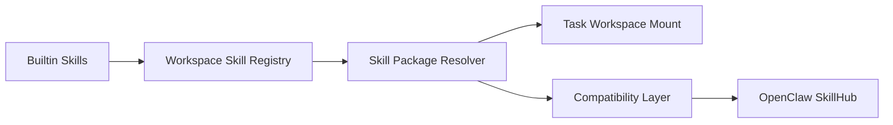

# 11. 规划中能力与产品路线图

## 11.1 为什么需要明确路线图

AgentSmith 当前已经不是一个“要不要做”的概念项目，而是一个已经形成产品骨架、需要决定“下一步优先把哪条能力做深”的平台。

如果没有清晰路线图，团队很容易落入三种常见陷阱：

1. 横向继续加页面，却没有补上关键闭环
2. 过早扩大战略叙事，进入组织级、平台级大而全描述
3. 在未完成基础控制面和数据面能力前，就过度包装生态故事

因此，路线图的核心目的不是罗列想法，而是建立一条现实、可信、与当前架构连续的演进路径。

## 11.2 规划原则

后续规划应满足三个条件：

1. 服务于当前主线，而不是发散出新产品叙事。
2. 让现有闭环更完整、更可运营，而不是单纯“多一个页面”。
3. 尽量沿现有模块扩展，不另起炉灶。

## 11.3 规划能力全景

| 规划能力 | 当前状态 | 业务价值 | 技术价值 |
|---|---|---|---|
| 使用 K8s / Sandbox Manager 托管 internal agent | 已有骨架，待完善 | 提升企业对托管执行的信任度 | 强化执行隔离和运行稳定性 |
| 更完整的 workspace backend provisioning | 状态机已实现，闭环未完成 | 让 workspace 真正成为可开通租户 | 完成控制面到数据面的闭环 |
| 更严格的 tenant data isolation | 已部分开始 | 增强多租户安全叙事 | 降低跨租户污染风险 |
| IdP connectivity validation | 仅最小校验 | 提升 workspace 发布可靠性 | 减少配置成功但登录失败的情况 |
| 统一智能体运行环境 | 已有 Notebook/runner/files 基础 | 把通用智能体从命令行工具升级为团队可用能力 | 把 sandbox、task workspace、files、artifact 串成完整运行面 |
| OpenClaw SkillHub 兼容层 | `规划中` | 扩展 skill 生态来源 | 复用现有 skill runtime 机制 |
| 通用 skill/工具注册与分发体系 | 已有 builtin skill 基础 | 提升平台扩展性和知识复用能力 | 建立标准化 skill source 机制 |
| Model catalog 版本化运营闭环 | 基础具备 | 提升 endpoint 管理一致性 | 强化模型目录数据治理 |
| 更强 secret 管理 | MVP 级 | 提升安全与合规信任度 | 降低凭据风险面 |

## 11.4 路线图建议

### Phase 1：补完控制面闭环

#### 目标

1. 完成 workspace provisioning 真正的发布闭环
2. 增强 System Info 的受控健康反馈
3. 补齐 IdP 最小可用性校验

#### 为什么先做这一阶段

因为 workspace 是整个系统的租户入口。如果这条线不闭环，其他高级能力都会建立在不够稳固的基础上。

#### 交付结果

1. workspace publish 真正完成后台基础资源初始化
2. `last_initialized_at / last_init_status / last_init_error` 更完整
3. system admin 可更可信地判断 workspace 是否可对外开放

### Phase 2：强化数据面隔离

#### 目标

1. 盘点所有 workspace 私有数据集合
2. 全面接入 tenant prefix / namespace 规则
3. 补齐自动化测试和证据

#### 为什么这是第二优先级

因为多租户平台一旦进入真实团队试运行，数据边界的可信度就是平台信誉的一部分。

#### 交付结果

1. endpoint、credential、project governance、audit/usage 等数据真正按 workspace 隔离
2. 多租户安全叙事从“规划”升级为“可验证”

### Phase 3：增强托管执行能力

#### 目标

1. 完善 internal agent 的 K8s sandbox 托管能力
2. 增强启动、keepalive、回收、失败反馈
3. 让 Notebook 托管执行具备更高可靠性
4. 让 agent 运行目录、输入输出和持久化文件系统的关系更产品化

#### 为什么这是第三优先级

因为托管执行能力是 AgentSmith 从“平台式 AI 工作流工具”走向“企业级 AI 执行平台”的关键转折点。

#### 交付结果

1. 托管 agent 成为标准能力线
2. internal agent 不再只是“有接口、有前端提示”的半成品路径
3. 通用智能体运行体验不再依赖高门槛命令行配置

### Phase 4：开放 skill 生态

#### 目标

1. 将当前 builtin skills 扩展为可治理的 skill 分发与兼容机制
2. 兼容更多 skill package 形式
3. 评估兼容 OpenClaw SkillHub 的 skill 元数据与分发协议

#### 建议方向

### 关于 OpenClaw SkillHub 兼容的说明

当前仓库未看到 OpenClaw SkillHub 的直接实现，但存在以下现实基础：

1. `SKILL.md` 作为技能包元数据与说明载体已被使用。
2. runner 已支持自动挂载 skills。
3. 用户级第三方凭据与 MCP 工具接入已存在。

因此，`兼容 OpenClaw SkillHub` 是合理且顺滑的下一阶段规划，而不是空中楼阁。

## 11.4.1 为什么“统一智能体运行环境”应被单独强调

对 OpenClaw 一类通用智能体来说，真正的落地障碍往往不是模型能力本身，而是：

1. 配置复杂
2. 运行环境不受控
3. 文件系统和运行结果不易管理
4. 难以让更多普通团队成员稳定使用

AgentSmith 的一个核心路线，不应只是“支持 agent”，而应是：

`把通用智能体的配置、运行、文件输入输出、凭据、产出沉淀，统一纳入一个更易用且更安全的平台环境。`

## 11.5 优先级建议

| 优先级 | 能力 | 原因 |
|---|---|---|
| P0 | workspace provisioning 闭环、tenant isolation 扩展、internal sandbox 稳定化 | 这三项直接决定平台是否可信、可用、可扩展 |
| P1 | 统一智能体运行环境、IdP validation、model catalog 运营闭环、secret 安全增强 | 决定平台是否能从“能管”走向“能稳定运行通用智能体” |
| P2 | Skill registry、OpenClaw SkillHub compatibility、更多外部工具链集成 | 属于平台扩展和生态能力增强 |

## 11.6 里程碑建议

### M1：可信开通

标志：

1. workspace publish 与 foundation bootstrap 形成可靠闭环
2. system info 可反映最小健康状态
3. 关键失败可追溯

### M2：可信隔离

标志：

1. workspace 私有数据面完成主要 tenant isolation
2. 有自动化验证证明隔离生效

### M3：可信托管执行

标志：

1. internal agent sandbox 形成稳定主链路
2. Notebook 托管执行可作为标准产品能力对外描述

### M4：可信扩展生态

标志：

1. skill 分发机制从 builtin 进化为 registry / compatibility 体系
2. OpenClaw SkillHub 兼容具备明确策略与接口边界

## 11.7 不建议优先做的事情

1. 系统级运营大盘
2. 复杂 KPI 看板
3. 组织级跨 project 总控治理
4. 重新引入模糊的 Runtime 产品面
5. 将 skill 生态先做成复杂市场，而不是先打通兼容与治理

## 11.8 本章结论

AgentSmith 下一阶段最重要的，不是“继续丰富功能菜单”，而是把已经显现出来的三条价值线真正做深：

1. 控制面可信
2. 数据面可信
3. 执行面可信

只有这样，后续的 skill 生态、兼容能力和平台化叙事才会站得住。
