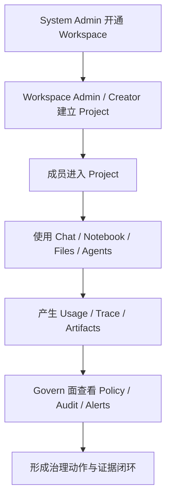
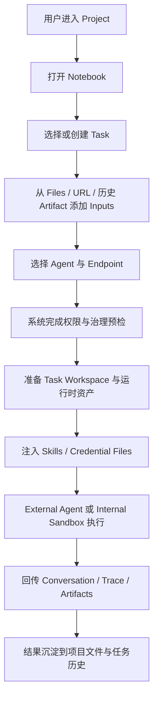

# 13. 用户故事与关键任务流

## 13.1 为什么单独写这一章

在 AgentSmith 这样的控制平面产品中，如果 PRD 只写模块、页面和字段，很容易出现两个问题：

1. 团队知道“有什么”，却不知道“为什么必须这样设计”
2. 角色边界、执行链路和治理闭环无法被串起来理解

因此，本章单独收口关键 `User Story` 与任务流，作为其他章节的“人和任务视角索引”。

## 13.2 User Story 是否适合写入本项目 PRD

答案是：适合，而且必要。

但应注意三点：

1. User Story 适合描述“谁、在什么场景下、为什么要完成某件事”。
2. 它不能替代功能需求、边界约束、异常处理和验收标准。
3. 最好的写法不是只列一句模板，而是让它与任务流和价值说明绑定。

## 13.3 系统管理侧用户故事

### US-01 创建 workspace 草稿

作为系统管理员，我希望先创建一个 workspace 草稿并保存其基础配置、管理员和 IdP 信息，这样我可以把“开通准备”与“正式发布”分开处理，降低误操作风险。

成功标准：

1. 可保存 draft
2. 可再次进入编辑
3. 不会立即开放业务入口

### US-02 发布 workspace

作为系统管理员，我希望通过显式发布动作触发初始化，并看到 `ready` 或 `failed` 的明确结果，这样我能知道该 workspace 是否真的可以交付给业务方使用。

成功标准：

1. 发布期间进入 `provisioning`
2. 成功进入 `ready`
3. 失败进入 `failed` 并保留错误摘要

## 13.4 工作区与项目治理用户故事

### US-03 授权 project creator

作为 workspace admin，我希望能授权某些成员创建项目，而不必把他们提升为 workspace admin，这样我可以扩大业务自治，同时保持系统级权限收敛。

### US-04 创建项目并自动成为 owner

作为 project creator，我希望在创建项目后自动成为 owner，这样我可以立即承担和管理这个项目，而不必再等待额外授权。

### US-05 委派 project admin

作为 project owner，我希望将资源和成员等日常治理工作委派给 project admin，同时保留 owner 转移和生命周期控制权，这样我能有效分工而不丢失最终责任。

## 13.5 使用面用户故事

### US-06 快速发起 AI 对话

作为项目成员，我希望在进入项目后快速选择可用模型或 agent 发起对话，并在需要时附带文件或图片，这样我能立即开始工作，而不是先学习复杂配置。

### US-07 组织一个可复用的 Notebook 任务

作为知识工作者或分析人员，我希望把文件、URL 和历史 artifact 组织成一个任务，让 agent 在该上下文中执行，并保留 trace 与产出，这样后续我或同事可以继续复用。

### US-07A 以更低门槛使用通用智能体

作为希望使用 OpenClaw 一类通用智能体的用户，我希望不必手工配置复杂的本地运行环境、目录结构、凭据文件和输入输出路径，而是通过 AgentSmith 的 Notebook 界面直接运行它们，这样我可以把精力放在任务本身，而不是环境搭建。

### US-08 在 Web 与本地之间共享项目文件

作为团队成员，我希望在 Web 文件库和本地挂载之间无缝查看和操作同一批项目文件，这样我可以把本地工作流和平台内工作流结合起来。

### US-08A 持久化智能体运行文件系统

作为运行通用智能体的用户，我希望运行过程中的输入文件、中间文件和结果文件能够自然落到项目文件库或可持久化的任务工作目录中，而不是散落在不可控的本地临时目录里，这样执行过程更安全，结果也更容易复用和协作。

### US-09 注册并使用一个项目 agent

作为技术协作者，我希望把一个外部或内部 agent 注册到项目中，并让 Chat 或 Notebook 可以标准化调用它，这样 agent 不再是个人脚本，而成为项目级能力。

### US-09A 在受控沙箱中运行通用智能体

作为平台建设者，我希望通用智能体优先运行在 AgentSmith 提供的受控沙箱环境中，而不是直接运行在用户宿主机上，这样我可以降低安全风险，并为后续企业级托管执行打下基础。

### US-09B 在统一界面中完成一次通用智能体任务

作为并不熟悉底层运行环境的业务或研发用户，我希望在同一个 Notebook 界面里完成“准备输入、发起执行、查看 trace、保存结果”这一整套流程，这样我不需要在命令行、文件夹和多个工具窗口之间来回切换。

成功标准：

1. 用户可以不依赖本地命令行完成一次任务
2. 输入、执行状态、结果和异常都可以在一个界面中查看
3. 任务结果可以直接复用到下一次任务

## 13.5A 通用智能体专题用户故事

为了突出 AgentSmith 作为“通用智能体运行环境”的价值，本章单独归纳一组更聚焦的用户故事。

### US-14 让 OpenClaw 从专家工具变成团队工具

作为团队负责人，我希望 OpenClaw 一类原本只有少数专家会配置的通用智能体，能够被团队成员通过 AgentSmith 稳定使用，这样智能体能力才不会停留在个别人的本地环境里。

### US-15 让本地文件工作流与平台任务工作流打通

作为长期依赖本地 IDE、脚本和目录工作的用户，我希望本地文件系统和 AgentSmith 项目文件库可以自然衔接，这样我既能保留熟悉的本地工作方式，也能把任务结果沉淀到平台中。

### US-16 让智能体运行结果成为项目资产

作为项目协作者，我希望智能体运行过程中产生的中间文件、图表、文本结果和最终产物都能以项目资产形式被查看和复用，这样这些结果不会随着单次运行结束而消失。

## 13.6 治理面用户故事

### US-10 配置项目 endpoint

作为项目管理员，我希望统一配置项目可用 endpoint，并让后续 Chat、Notebook 和 API 路径都围绕这些 endpoint 工作，这样我能集中管理模型资源和成本边界。

### US-11 为高价值资源设置资源策略

作为项目管理员，我希望按项目默认、资源覆盖和用户覆盖的方式配置访问和限制策略，这样我可以平衡开放使用与重点资源保护。

### US-12 查看个人 usage

作为普通成员，我希望查看自己在不同资源上的使用进度和剩余空间，这样我可以主动调整行为，而不是在被拒绝后才知道超限。

### US-13 审查最近的异常和变更

作为项目管理员，我希望快速看到最近的异常事件、策略变化和关键治理动作，并能按资源、时间、操作人过滤，这样我能高效完成审查和排障。

## 13.7 关键任务流总览

## 13.7A 通用智能体运行关键任务流

这个任务流体现了 AgentSmith 的一个核心差异化：

它不是只负责“调起一个 agent”，而是负责把运行前、运行中、运行后的关键对象统一组织起来。

## 13.7B 关键故事与亮点映射

| 亮点 | 对应 User Story | 对应模块 |
|---|---|---|
| 统一 Notebook 界面 | US-07 / US-07A / US-09B | Notebook |
| 本地文件系统与项目文件库衔接 | US-08 / US-15 | Files |
| 持久化运行文件系统 | US-08A / US-16 | Files / Notebook / Artifacts |
| 受控沙箱运行 | US-09A | Agents / Sandbox Runtime |
| 让通用智能体更易用 | US-07A / US-14 | Notebook / Agents / Skills |

## 13.8 User Story 与功能需求的对应关系

| User Story | 对应模块 |
|---|---|
| US-01 / US-02 | System Workspaces / System Info |
| US-03 / US-04 / US-05 | Workspace Settings / Projects / Project Settings / Members |
| US-06 | Chat |
| US-07 / US-07A / US-09B | Notebook |
| US-08 / US-08A / US-15 | Files |
| US-09 / US-09A / US-14 | Agents / Sandbox Runtime / Skills |
| US-10 | Endpoints |
| US-11 | Resource Policy |
| US-12 | Usage |
| US-13 | Audit / Alerts |
| US-16 | Files / Notebook / Artifacts |

## 13.9 本章结论

把 User Story 纳入 AgentSmith PRD 是合理的，因为它能把：

1. 角色
2. 权限
3. 产品结构
4. 执行链路
5. 价值判断

放进同一个叙事框架里。

后续如果继续升级 PRD，建议每个核心模块都维持以下结构：

1. 背景
2. 用户
3. 用户故事
4. 任务流
5. 功能需求
6. 异常与边界
7. 验收标准
