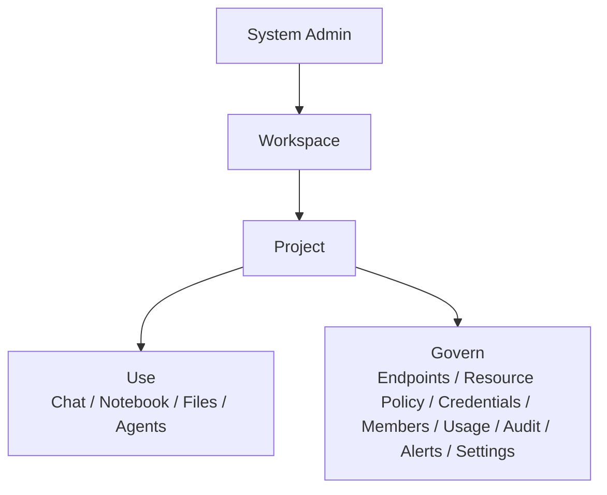
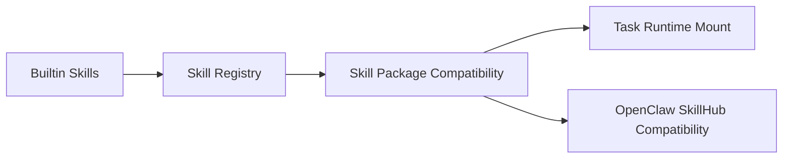

# AgentSmith 产品白皮书版 v1

## 1. 产品摘要

AgentSmith 是 MBOS 面向企业场景打造的多租户 AI 控制平面，同时也是通用智能体的易用且安全的运行环境。它帮助企业在 `工作区 - 项目 - 资源 - 智能体` 的统一结构下，安全、可控、可审计地使用 AI，并把原本难以配置、难以协作的通用智能体纳入统一产品界面中。

它解决的不是“如何再接一个大模型 API”，而是企业在真实落地 AI 时最常见的五类问题：

1. AI 能力如何在多团队、多项目之间安全使用。
2. Chat、Notebook、Agent、Files 等能力如何统一纳入治理。
3. 谁在使用什么资源、花费了多少、出了什么问题，如何追溯。
4. 企业如何在保持灵活性的同时，逐步走向托管执行、隔离运行和技能生态扩展。
5. 通用智能体如何摆脱“本地命令行 + 临时目录 + 手工配置”的高门槛使用方式。

## 2. 为什么需要 AgentSmith

企业进入 AI 应用阶段后，常常会遇到以下结构性问题：

| 问题 | 传统做法的不足 |
|---|---|
| AI 工具分散 | 各团队各自接模型、接工具，缺乏统一治理 |
| 权限和身份混乱 | 角色、资源、项目边界不清，导致使用与审计失控 |
| Notebook、Chat、Agent 脱节 | 使用体验和治理体验是两套系统 |
| 缺少证据链 | 出问题后难以回答“谁、何时、用什么资源、执行了什么” |
| 平台扩展性弱 | 很难继续演进到托管 sandbox、skills、MCP、第三方工具集成 |

AgentSmith 的设计目标，就是把这些分散问题收敛进一个企业级 AI 控制平面。

但它的价值不止于治理。

对于 OpenClaw 一类通用智能体，真正阻碍落地的往往不是模型能力，而是：

1. 配置复杂
2. 默认运行环境不够安全
3. 文件输入输出散落在本地目录
4. 很难给非专家用户提供稳定入口

AgentSmith 通过统一的 Notebook 任务界面、项目文件库、受控沙箱运行路径和凭据/技能挂载机制，正在把这类通用智能体变成企业可使用、可复用、可治理的项目级能力。

## 3. 产品定位

AgentSmith 的核心定位可以概括为四句话：

1. 它是 MBOS 的企业级多租户控制平面。
2. 它是项目级 AI 使用与治理平台。
3. 它是连接 Chat、Notebook、Files、Agents 与资源治理证据的统一枢纽。
4. 它是通用智能体的统一操作界面与安全运行底座。

当前产品主线非常明确：

`以项目级 LLM endpoint 为治理主线，以 Notebook + Files + Agents + Sandbox 为运行主线，统一承接 AI 使用、资源配置、限制约束、审计追踪与智能体执行证据。`

## 4. 产品结构

这套结构的意义在于：

1. `System Admin` 负责工作区生命周期和租户基线。
2. `Workspace` 负责承接企业内部团队或业务域边界。
3. `Project` 是 AI 使用与治理的真正工作单元。
4. `Use` 与 `Govern` 不再割裂，而是围绕同一套资源和证据体系协同工作。

## 5. 核心产品价值

## 5.1 对企业管理者的价值

1. 让企业能以工作区和项目为边界引入 AI，而不是放任工具野蛮生长。
2. 让模型调用、资源配置、用量消耗与审计证据进入统一视角。
3. 为后续安全、合规、隔离运行和平台化扩展打下基础。

## 5.2 对业务团队的价值

1. 用统一入口使用 Chat、Notebook、Files 和 Agents。
2. 不必自己拼装权限系统、文件链路和 agent 调用协议。
3. 能在项目上下文里持续复用文件、输入、artifact 和技能能力。
4. 能以远低于原生命令行方式的门槛使用 OpenClaw 一类通用智能体。
5. 能把本地文件工作流和平台内任务工作流自然衔接起来。

## 5.3 对平台与工程团队的价值

1. 权限、路由、资源、协议和执行链路有统一边界。
2. 可渐进演进到托管执行、sandbox、租户隔离和 skill 生态。
3. 有利于形成稳定的 API contract、测试基线与交付标准。

## 6. 关键能力全景

## 6.1 系统管理侧

AgentSmith 已具备独立的系统管理入口，用于：

1. 创建和配置 workspace
2. 配置 workspace 管理员
3. 绑定 Keycloak 作为身份提供商
4. 自动生成 tenant 隔离命名预览
5. 管理 workspace 的发布与禁用状态
6. 查看系统级基础状态

其核心价值在于，把“租户开通”从模糊的后台配置动作升级为可视、可管、可追踪的控制面动作。

## 6.2 工作区与项目治理

平台已形成较清晰的角色与权限层次：

1. `System Admin` 管理 workspace 生命周期
2. `Workspace Admin` 管理 project 创建权限与必要的 owner 上层治理
3. `Project Creator` 创建项目并自动成为 owner
4. `Project Owner` 掌握生命周期和最终责任
5. `Project Admin` 负责项目治理，但不掌握所有权

这使得组织内部可以逐步建立企业级 AI 项目治理秩序，而不需要把所有高权限都堆给少数管理员。

## 6.3 核心使用面

### Chat

支持项目内对话式 AI 使用，能够基于 endpoint 或 external agent 发起流式对话，并支持附件、多模态前置能力判断与稳定错误映射。

### Notebook

支持任务式智能体工作流，把 `输入 - 执行 - 对话 - trace - artifact` 组织成完整闭环，是 AgentSmith 当前最具平台潜力的模块之一。

更重要的是，Notebook 正在承担“统一智能体操作界面”的职责。它把过去需要在命令行、目录结构、脚本和临时文件里完成的工作，重新组织成标准任务界面，显著降低了通用智能体的使用门槛。

### Files

提供项目级文件库，支撑上传、下载、浏览、挂载与本地协同，成为 Notebook 与 Agent 工作流的关键上下文来源。

它的关键意义在于，平台并不是把文件当成一次性附件，而是把它们变成通用智能体运行过程中的输入来源、运行工作区延伸和产出沉淀位置。

### Agents

支持管理 external agent 与 internal agent，并通过统一 WebSocket 协议对接执行请求、trace 事件与 artifact 回传。

这使 AgentSmith 能把强大但原本偏个人化、脚本化的通用智能体，转变成项目级的正式执行能力。

## 6.4 治理与证据面

### Endpoints

统一管理项目可用模型资源，是整个平台治理主线的核心对象。

### Resource Policy

围绕 endpoint 做访问控制、rate limit 与 spending limit 管理。

### Usage

面向普通用户，帮助其理解“我在用什么资源、用了多少、距离上限还有多远”。

### Audit

面向管理员，帮助其回答“最近发生了什么、谁做了什么、哪里出了问题、如何追溯”。

### Alerts

作为项目级治理信号层，承接异常热点与治理提醒，而不是把平台带偏成运维告警编排系统。

## 7. 差异化竞争力

相比常见的“模型接入面板”或“单一 Agent 工具层”，AgentSmith 的差异化在于：

### 7.1 它不是单点能力，而是控制平面

AgentSmith 不是只解决“能不能调用模型”，而是解决：

1. 谁能用
2. 在哪个项目里用
3. 用了什么资源
4. 是否超限
5. 如何追溯
6. 如何逐步走向托管执行

### 7.2 它把使用面与治理面放在同一结构下

很多产品要么偏工具体验，要么偏治理后台。AgentSmith 的强点在于：

1. Chat、Notebook、Files、Agents 不是孤立模块
2. Endpoints、Policy、Usage、Audit 也不是孤立后台
3. 两者以 `Project + Resource + Evidence` 为统一骨架

### 7.3 它把通用智能体从命令行工具升级为产品化运行能力

很多智能体平台只提供“能跑”的能力，但没有真正解决“谁来用、在哪里用、如何安全地用、文件如何沉淀”的问题。

AgentSmith 的差异化在于：

1. 它提供统一 Notebook 界面承接复杂任务运行。
2. 它提供项目文件库与本地挂载桥接，降低输入输出管理成本。
3. 它提供受控沙箱路径，减少直接依赖宿主机环境的安全风险。
4. 它为持久化运行文件系统和 skill 生态扩展预留了结构。

### 7.4 它具备向企业级托管平台演进的基础

当前产品已经具备以下重要基础：

1. workspace 控制平面状态模型
2. agent execution protocol
3. internal sandbox 接入骨架
4. builtin skills 自动挂载机制
5. 第三方账户与凭据基础
6. Notebook / Files / Artifacts 组成的持久化上下文基础

这意味着它天然适合继续演进，而不是一套很快碰到上限的演示型产品。

## 8. 当前成熟度判断

从产品成熟度角度，AgentSmith 当前处于一个非常有价值的阶段：

### 已经具备的部分

1. 明确的产品边界和信息架构
2. 可运行的系统管理侧、workspace 入口与项目主链路
3. 完整度较高的 Chat、Notebook、Files、Agents 使用面
4. 可落地的 Endpoints、Policy、Usage、Audit 等治理主面
5. 稳定的权限模型和合同化趋势

### 正在收敛中的部分

1. workspace provisioning 的后台真实闭环
2. 多租户数据面的全面 tenant isolation
3. internal agent sandbox 的基础设施级稳定化
4. model catalog 的完整版本化运营闭环
5. 更强的 secret 安全姿态
6. 通用智能体运行目录与项目文件库更自然的一体化

换句话说，AgentSmith 已经越过“概念验证”阶段，但还在从“骨架成熟”迈向“平台成熟”的关键路口。

## 9. 未来路线图

## 9.1 第一阶段：补完控制面与隔离基础

重点目标：

1. 让 workspace publish 真正完成后台基础资源初始化
2. 让 tenant isolation 覆盖更多 workspace 私有数据域
3. 让系统管理员可更可信地判断 workspace 是否可开放使用

## 9.2 第二阶段：增强托管执行能力

重点目标：

1. 使用 K8s / Sandbox Manager 托管 internal agent
2. 建立更稳定的启动、保活、回收与失败反馈机制
3. 让 Notebook 托管执行成为标准能力
4. 让运行文件系统、输入输出和项目文件库之间的关系更自然、更可持久化

## 9.3 第三阶段：开放 skill 与工具生态

重点目标：

1. 从 builtin skills 走向可治理的 skill 分发体系
2. 扩展 skill package 兼容性
3. 兼容 OpenClaw SkillHub 等外部 skill 生态

## 10. 目标客户与适用场景

AgentSmith 特别适合以下类型客户：

### 10.1 企业 AI 平台团队

需要统一承接多个业务团队的 AI 使用需求，同时保留权限、审计和资源边界。

### 10.2 有 agent 与 notebook 工作流需求的研发组织

需要让文件、上下文、执行 trace、artifact 与运行目录形成标准工作流，而不是分散在多个系统中。

### 10.3 对可控性要求高的行业客户

例如平台型公司、研发型团队、对安全和追溯要求较高的企业场景。

## 11. 结论

AgentSmith 最有价值的地方，不只是“模块多”，而是它已经形成一条非常清晰的企业 AI 控制平面主线：

`System Admin -> Workspace -> Project -> Use -> Govern -> Evidence`

这条主线让它既能承接当前的 AI 使用需求，也能为未来的托管 sandbox、数据隔离、skill 生态和更强平台治理能力留下足够空间。

如果把产品发展分成三个阶段：

1. 能用
2. 可控
3. 可平台化

那么 AgentSmith 当前已经稳稳站在“能用 + 可控”的交界处，并且正朝着“可平台化”迈进。
