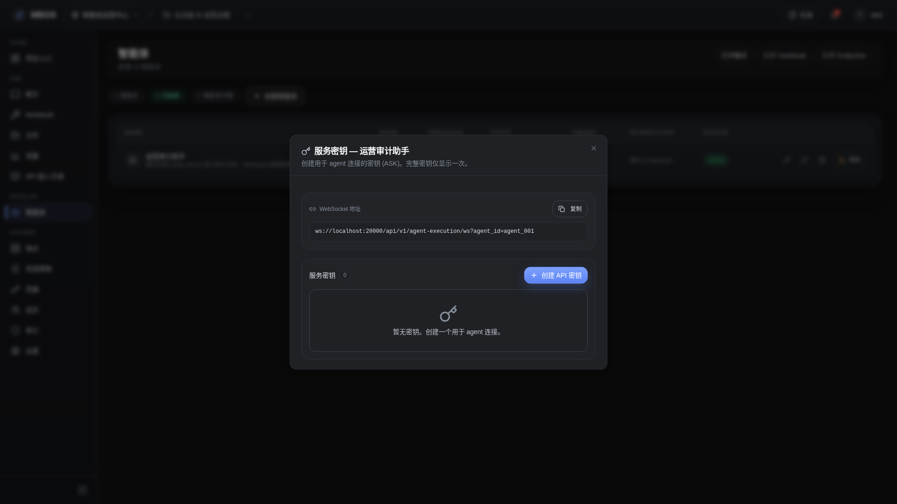

# 智能体连接信息对话框

- 功能分组：治理与运营
- 适用角色：项目管理员
- 功能路径：/zh-CN/workspaces/ws_default/projects/proj_001/agents

## 页面截图

## 功能说明

连接信息对话框展示 external agent 的连接地址、服务 key 和接入说明，用于接入本地 codex runner。

## 页面内容说明

- 展示 WebSocket 地址和服务 key 列表。
- 用于说明 external agent 与本地 runner 的连接方式。

## 用户操作

1. 在智能体列表中打开 key/连接信息。
2. 复制连接地址与 key。
3. 在本地 runner 中完成接入。

## 截图文件

- [dialog-agent-connection-info.png](./dialog-agent-connection-info.png)

