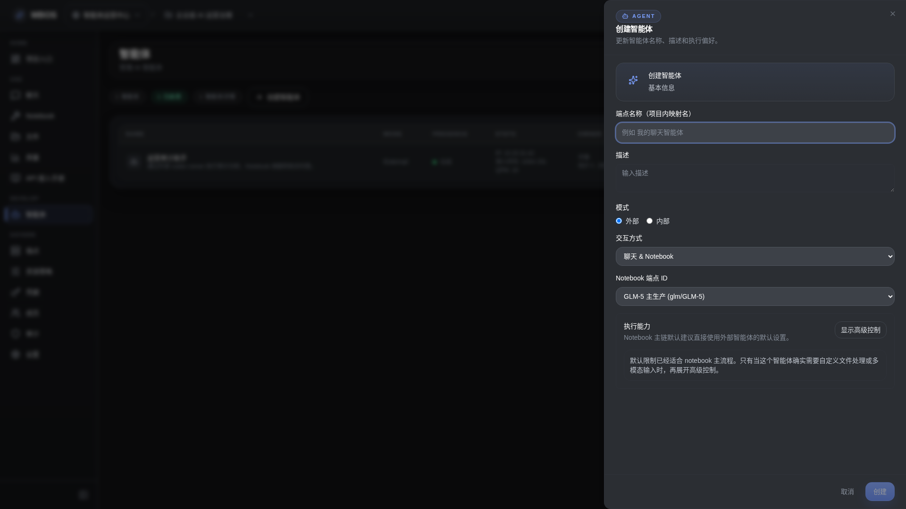

# 创建智能体对话框

- 功能分组：治理与运营
- 适用角色：项目管理员
- 功能路径：/zh-CN/workspaces/ws_default/projects/proj_001/agents

## 页面截图

## 功能说明

创建智能体对话框用于定义 agent 的名称、运行模式、能力边界和接入方式，是管理 external agent 的关键入口。

## 页面内容说明

- 表单展示智能体名称、模式、说明和可选行为配置。
- 适合说明 external agent 与本地 codex runner 的接入关系。

## 用户操作

1. 点击“创建智能体”。
2. 填写名称、模式和说明。
3. 保存后再配置连接信息或服务 key。

## 截图文件

- [dialog-agent-create.png](./dialog-agent-create.png)

