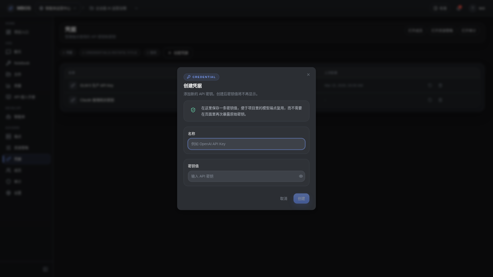

# 创建凭据对话框

- 功能分组：治理与运营
- 适用角色：项目管理员
- 功能路径：/zh-CN/workspaces/ws_default/projects/proj_001/credentials

## 页面截图

## 功能说明

创建凭据对话框用于录入模型服务、第三方平台或代理服务所需的密钥信息，是 endpoint 接入的前置步骤。

## 页面内容说明

- 表单包含凭据名称、类型、密钥字段和可选说明。
- 创建后的凭据可被 endpoint 复用，用于统一治理和轮换。

## 用户操作

1. 点击“创建凭据”。
2. 填写名称和密钥内容。
3. 保存后回到凭据列表并用于 endpoint 配置。

## 截图文件

- [dialog-credential-create.png](./dialog-credential-create.png)

