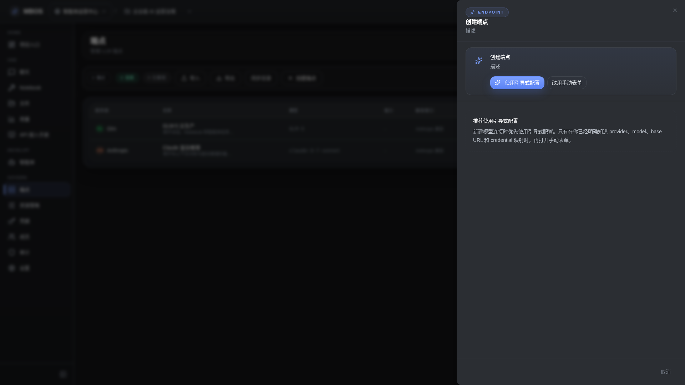

# 创建 Endpoint 对话框

- 功能分组：治理与运营
- 适用角色：项目管理员
- 功能路径：/zh-CN/workspaces/ws_default/projects/proj_001/endpoints

## 页面截图

## 功能说明

创建 Endpoint 对话框用于定义模型入口、协议、模型名和绑定凭据，是企业级统一接入的核心配置入口。

## 页面内容说明

- 表单展示 endpoint 名称、协议类型、模型标识、凭据绑定等字段。
- 创建后可被 Chat、Notebook 和智能体统一复用。

## 用户操作

1. 点击“创建 Endpoint”。
2. 填写模型、协议和凭据绑定信息。
3. 保存后在列表中查看并纳入治理。

## 截图文件

- [dialog-endpoint-create.png](./dialog-endpoint-create.png)

