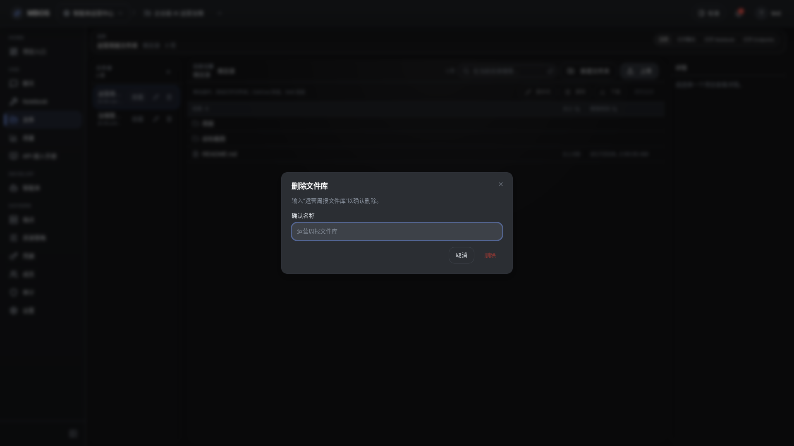

# 非空文件库删除受阻对话框

- 功能分组：文件管理
- 适用角色：项目成员
- 功能路径：/zh-CN/workspaces/ws_default/projects/proj_001/files

## 页面截图

## 功能说明

删除对话框用于确认文件库删除操作。对非空文件库，系统会要求用户明确确认名称，避免误删共享资料。

## 页面内容说明

- 对话框展示待删除文件库名称和确认输入框。
- 用于说明文件库删除的安全保护机制。

## 用户操作

1. 在文件库列表中点击删除。
2. 核对名称并输入确认内容。
3. 清空文件后再执行最终删除。

## 截图文件

- [dialog-file-library-delete-denied.png](./dialog-file-library-delete-denied.png)

