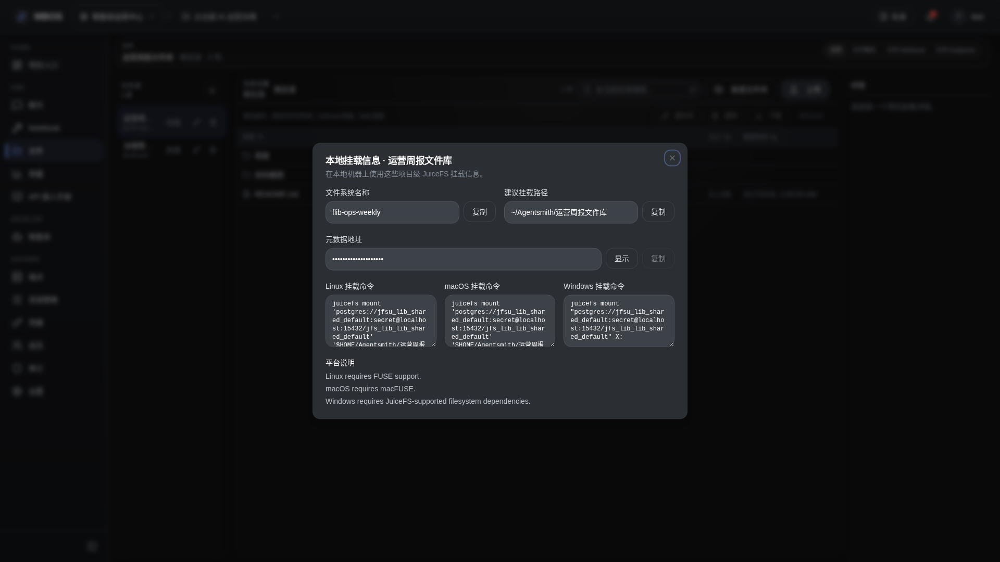

# 文件库本地挂载说明

- 功能分组：文件管理
- 适用角色：项目成员
- 功能路径：/zh-CN/workspaces/ws_default/projects/proj_001/files

## 页面截图

## 功能说明

挂载说明对话框展示 filesystem 名称、metadata URL 和多平台挂载命令，用于把项目文件库挂载到本地目录。

## 页面内容说明

- 对话框展示 JuiceFS 挂载所需的关键信息。
- 支持复制 metadata URL 和查看推荐挂载路径。

## 用户操作

1. 点击文件库右侧的挂载入口。
2. 查看并复制挂载信息。
3. 在本地执行 JuiceFS 挂载命令后与 Web 端同步操作。

## 截图文件

- [dialog-file-library-mount-access.png](./dialog-file-library-mount-access.png)

