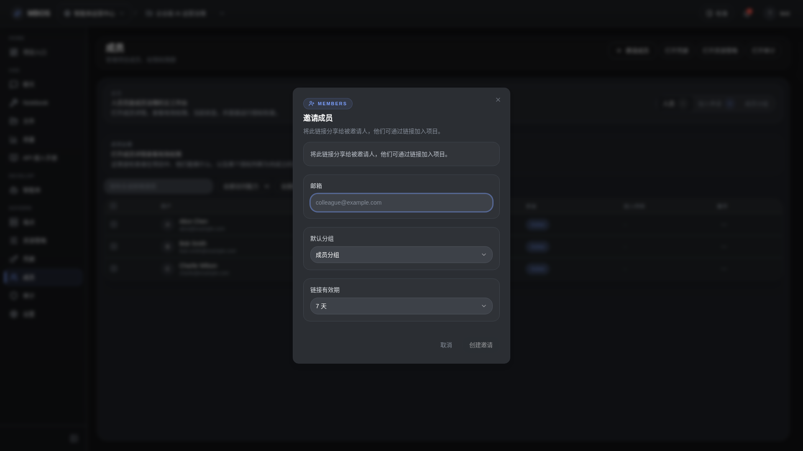

# 邀请成员对话框

- 功能分组：治理与运营
- 适用角色：项目管理员
- 功能路径：/zh-CN/workspaces/ws_default/projects/proj_001/members?member_tab=people

## 页面截图

## 功能说明

邀请成员对话框用于向项目添加成员、指定分组或角色来源，是权限治理的起点。

## 页面内容说明

- 表单支持录入成员邮箱、选择权限分组和说明。
- 邀请结果会出现在成员列表和相关治理视图中。

## 用户操作

1. 点击“邀请成员”。
2. 填写邮箱并选择成员分组。
3. 发送邀请后在成员列表中跟踪状态。

## 截图文件

- [dialog-member-invite.png](./dialog-member-invite.png)

