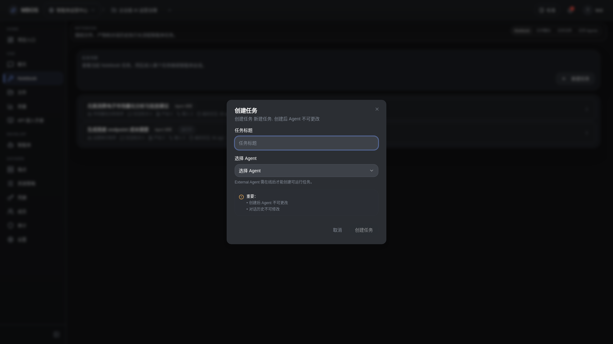

# 创建任务对话框

- 功能分组：Notebook 任务
- 适用角色：项目成员
- 功能路径：/zh-CN/workspaces/ws_default/projects/proj_001/notebook

## 页面截图

## 功能说明

创建任务对话框用于新建长期运行的智能体任务，选择执行智能体并设定任务标题，是 Notebook 工作流的起点。

## 页面内容说明

- 表单展示任务标题、可用智能体选择和关键提示信息。
- 适合说明长期任务与普通聊天的区别。

## 用户操作

1. 点击“创建任务”。
2. 填写任务标题并选择执行智能体。
3. 提交后进入任务详情页观察执行过程。

## 截图文件

- [dialog-notebook-task-create.png](./dialog-notebook-task-create.png)

