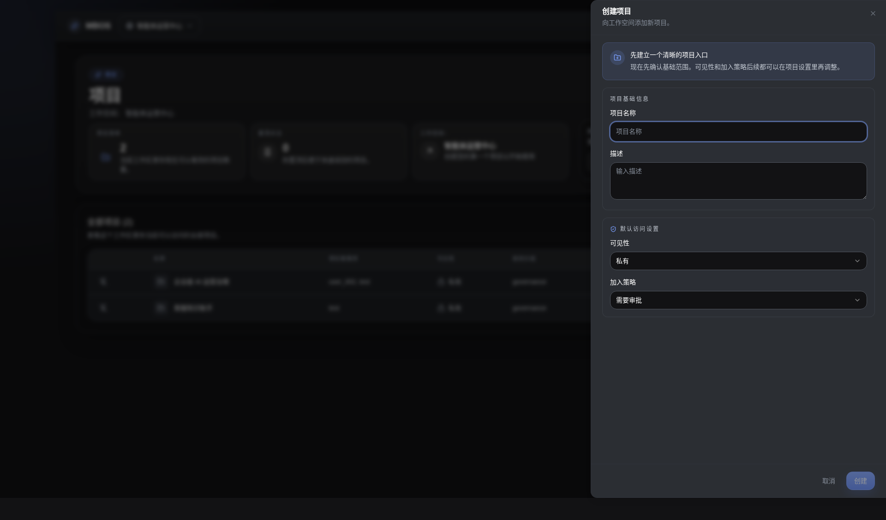

# 创建项目对话框

- 功能分组：工作区与项目
- 适用角色：工作区成员
- 功能路径：/zh-CN/workspaces/ws_default

## 页面截图

## 功能说明

项目创建对话框用于设置项目名称、可见性和基本说明，是用户进入项目治理与智能体使用的第一步。

## 页面内容说明

- 表单包含项目名称、描述和访问策略等字段。
- 提交后会在当前工作区下创建新的项目记录。

## 用户操作

1. 点击“创建项目”。
2. 填写项目名称与说明。
3. 确认后进入新项目或返回项目列表。

## 截图文件

- [dialog-project-create.png](./dialog-project-create.png)

