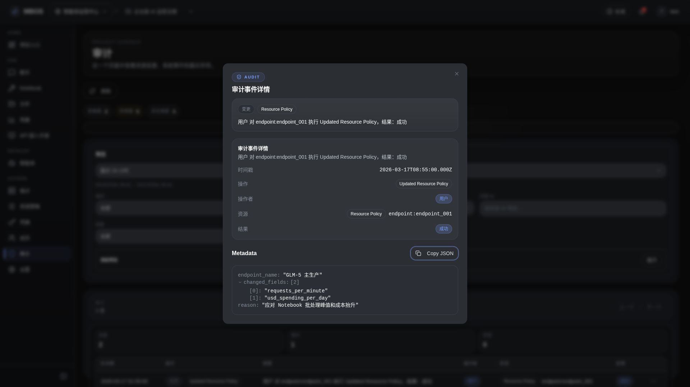

# 审计详情抽屉

- 功能分组：治理与运营
- 适用角色：项目管理员
- 功能路径：/zh-CN/workspaces/ws_default/projects/proj_001/audit

## 页面截图

## 功能说明

审计详情抽屉展示单条事件的上下文、治理入口和责任信息，方便管理员从事件快速跳转到相关配置页面。

## 页面内容说明

- 抽屉包含摘要、责任归属和治理快捷入口。
- 可直接跳转到资源策略、成员访问或用量页面。

## 用户操作

1. 在审计表格中打开操作菜单。
2. 点击“查看详情”。
3. 根据详情中的入口继续排查或修正配置。

## 截图文件

- [drawer-audit-detail.png](./drawer-audit-detail.png)

