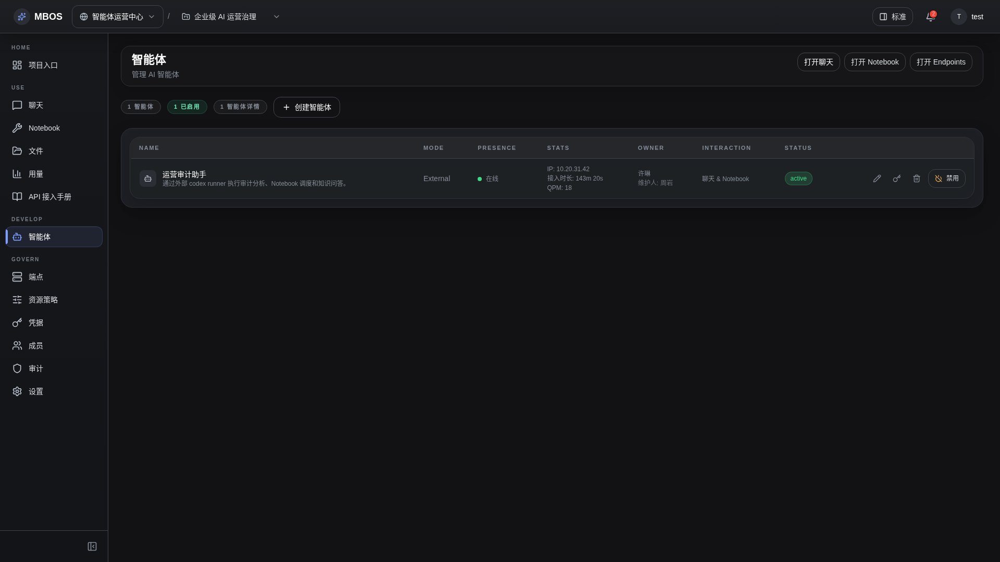

# 智能体管理

- 功能分组：治理与运营
- 适用角色：项目管理员
- 功能路径：/zh-CN/workspaces/ws_default/projects/proj_001/agents

## 页面截图

## 功能说明

智能体页面用于管理 external/internal agent，查看在线状态、运行模式和入口能力。

## 页面内容说明

- 页面展示智能体名称、模式、在线状态和负责管理员。
- 适合用来说明 external agent 与 codex runner 的接入路径。

## 用户操作

1. 查看当前项目下的智能体清单。
2. 根据状态判断是聊天、Notebook 还是双模式使用。
3. 进一步打开连接信息或服务 key 管理。

## 截图文件

- [project-agents.png](./project-agents.png)

