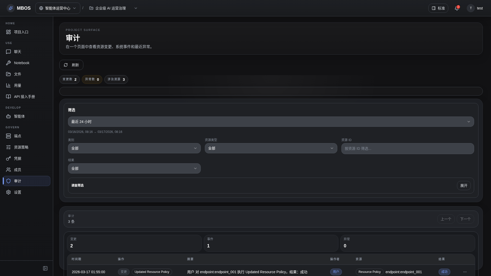

# 审计日志

- 功能分组：治理与运营
- 适用角色：项目管理员
- 功能路径：/zh-CN/workspaces/ws_default/projects/proj_001/audit

## 页面截图

## 功能说明

审计页面用于追踪配置变更、endpoint 调用和治理动作，是可追责和复盘的核心证据面。

## 页面内容说明

- 页面展示审计摘要、过滤器和事件表格。
- 示例中包含策略更新、endpoint 调用和 agent key 创建事件。

## 用户操作

1. 通过过滤器定位指定资源或动作。
2. 打开详情抽屉查看上下文与关联治理入口。

## 截图文件

- [project-audit.png](./project-audit.png)

