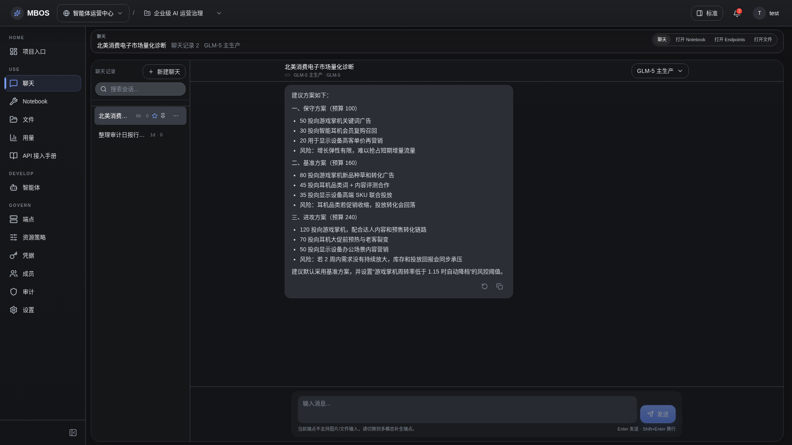

# Chat 多轮会话

- 功能分组：Chat 对话
- 适用角色：项目成员
- 功能路径：/zh-CN/workspaces/ws_default/projects/proj_001/chat

## 页面截图

## 功能说明

Chat 页面展示多轮对话、线程列表和输入区，适合做交互式提问、分析和结果迭代。

## 页面内容说明

- 左侧为会话线程列表，右侧为当前会话消息内容。
- 示例数据展示了围绕 GLM-5 调用波动的多轮分析对话。

## 用户操作

1. 在左侧选择已有会话，或新建会话。
2. 在输入框中继续追问或补充上下文。
3. 查看 assistant 的结构化回复并继续迭代。

## 截图文件

- [project-chat-session.png](./project-chat-session.png)

