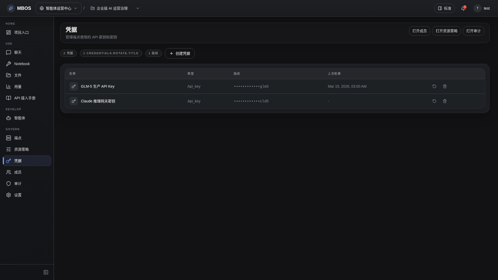

# 凭据管理

- 功能分组：治理与运营
- 适用角色：项目管理员
- 功能路径：/zh-CN/workspaces/ws_default/projects/proj_001/credentials

## 页面截图

## 功能说明

凭据页集中管理对接第三方模型和服务所需的凭据，并与 endpoint 和 agent 形成治理闭环。

## 页面内容说明

- 页面展示凭据名称、类型和轮换时间。
- 支持新建、轮换和删除等关键操作。

## 用户操作

1. 查看现有凭据清单。
2. 按需创建或轮换凭据。
3. 为 endpoint 配置对应的 credential 引用。

## 截图文件

- [project-credentials.png](./project-credentials.png)

