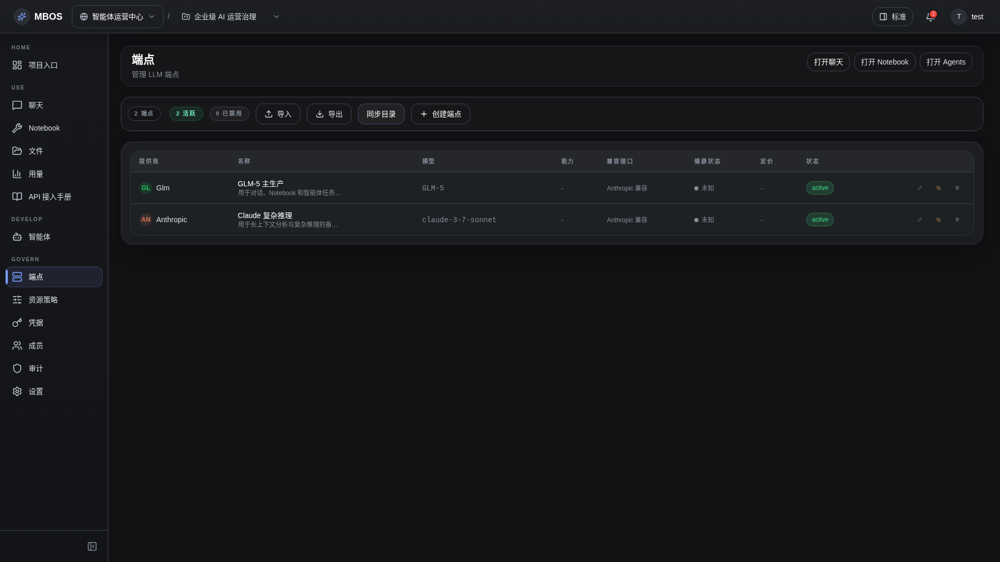

# Endpoint 管理

- 功能分组：治理与运营
- 适用角色：项目管理员
- 功能路径：/zh-CN/workspaces/ws_default/projects/proj_001/endpoints

## 页面截图

## 功能说明

Endpoint 页面统一管理各类模型入口，是 AI 开发工具、智能体和 Notebook 的统一接入面。

## 页面内容说明

- 页面展示 endpoint 名称、模型、协议、状态和基础限额。
- 示例中包含 GLM-5 主生产和 Claude 复杂推理两个入口。

## 用户操作

1. 创建或编辑 endpoint。
2. 为 endpoint 绑定 credential。
3. 将 endpoint 分配给 Chat、Notebook 或 agent 使用。

## 截图文件

- [project-endpoints.png](./project-endpoints.png)

