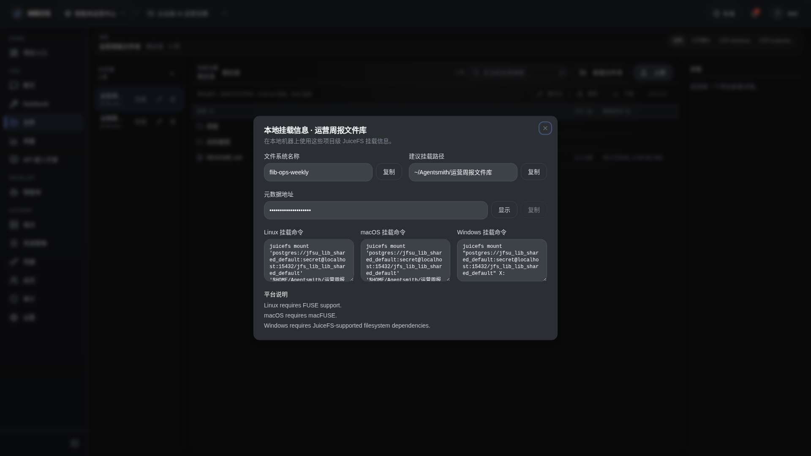

# 文件库管理

- 功能分组：文件管理
- 适用角色：项目成员
- 功能路径：/zh-CN/workspaces/ws_default/projects/proj_001/files

## 页面截图

## 功能说明

Files 页面用于管理项目文件库、浏览目录、查看文件详情，并支持与本地挂载目录同步。

## 页面内容说明

- 左侧展示文件库列表，中间展示目录与文件，右侧展示详情面板。
- 示例文件库包含周报、巡检截图和治理模板等真实风格内容。

## 用户操作

1. 选择文件库进入浏览。
2. 点击文件查看详情。
3. 通过页面进行上传、下载、重命名或删除。

## 截图文件

- [project-files.png](./project-files.png)

