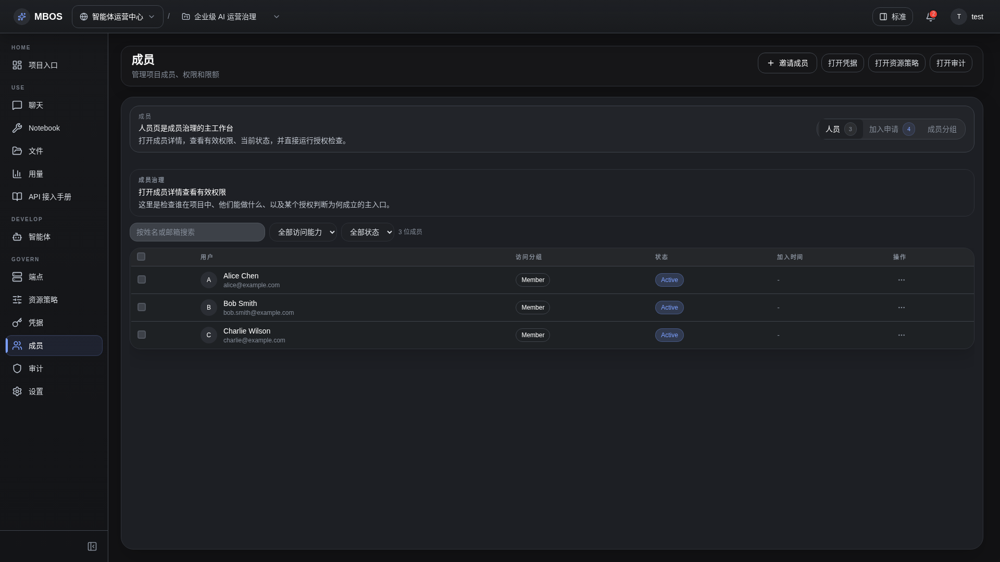

# 成员治理

- 功能分组：治理与运营
- 适用角色：项目管理员
- 功能路径：/zh-CN/workspaces/ws_default/projects/proj_001/members?member_tab=people

## 页面截图

## 功能说明

成员治理页面用于管理成员、加入申请、权限模板和有效访问范围，是项目权限控制的核心界面。

## 页面内容说明

- 页面展示成员列表、搜索和治理标签页。
- 适合说明项目成员、管理员和审批链路。

## 用户操作

1. 搜索成员并查看当前状态。
2. 处理加入申请或调整分组。
3. 进入有效访问详情核对权限来源。

## 截图文件

- [project-members.png](./project-members.png)

