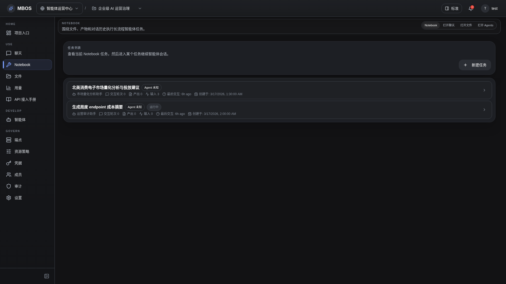

# Notebook 任务列表

- 功能分组：Notebook 任务
- 适用角色：项目成员
- 功能路径：/zh-CN/workspaces/ws_default/projects/proj_001/notebook

## 页面截图

## 功能说明

Notebook 页面展示长期任务列表，适合执行更长流程的智能体任务、保留上下文和沉淀产物。

## 页面内容说明

- 列表中展示任务标题、状态、绑定智能体和最近活动时间。
- 适合用于执行审计分析、报告汇总、文件处理等长流程任务。

## 用户操作

1. 进入 Notebook 查看现有任务。
2. 点击某个任务进入详情页继续查看执行过程和结果。

## 截图文件

- [project-notebook-list.png](./project-notebook-list.png)

