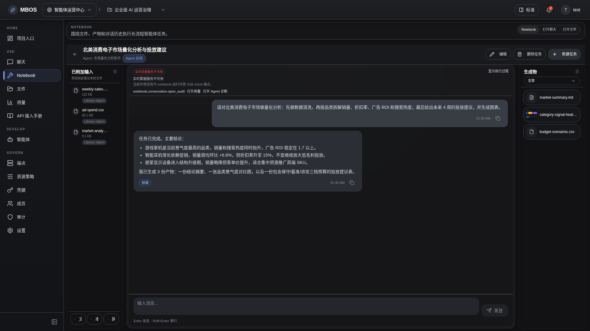

# Notebook 任务详情

- 功能分组：Notebook 任务
- 适用角色：项目成员
- 功能路径：/zh-CN/workspaces/ws_default/projects/proj_001/notebook/tasks/task_doc_001

## 页面截图

## 功能说明

任务详情页集中展示任务消息、运行状态、trace 和产物，是长期智能体执行的核心证据页面。

## 页面内容说明

- 页面展示任务标题、绑定 agent、消息过程和最终产物。
- 示例任务包含 trace、artifact 和已完成状态，适合用于功能说明书。

## 用户操作

1. 打开具体任务查看执行过程。
2. 展开 trace 面板定位关键步骤。
3. 查看或下载产物文件。

## 截图文件

- [project-notebook-task-detail.png](./project-notebook-task-detail.png)

