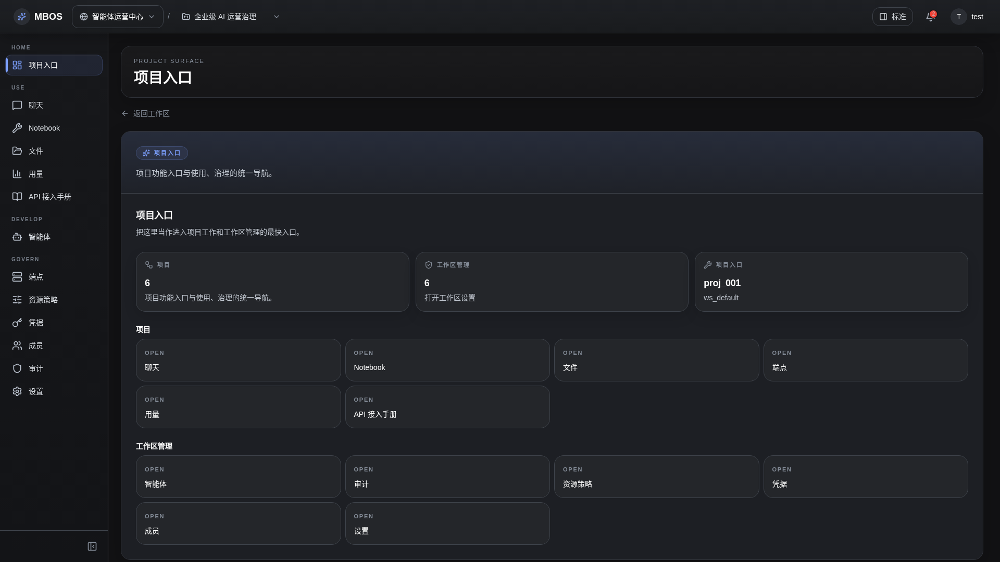

# 项目总览

- 功能分组：工作区与项目
- 适用角色：项目成员
- 功能路径：/zh-CN/workspaces/ws_default/projects/proj_001/overview

## 页面截图

## 功能说明

项目总览页集中展示项目运行状态、关键入口和治理维度，是进入 Chat、Notebook、Files 和治理页面的统一入口。

## 页面内容说明

- 页面展示项目核心说明和关键工作台入口。
- 用户可从这里快速跳转到聊天、任务、文件和治理相关页面。

## 用户操作

1. 进入项目后先查看总览信息。
2. 根据目标工作选择 Chat、Notebook、Files 或治理页面。

## 截图文件

- [project-overview.png](./project-overview.png)

