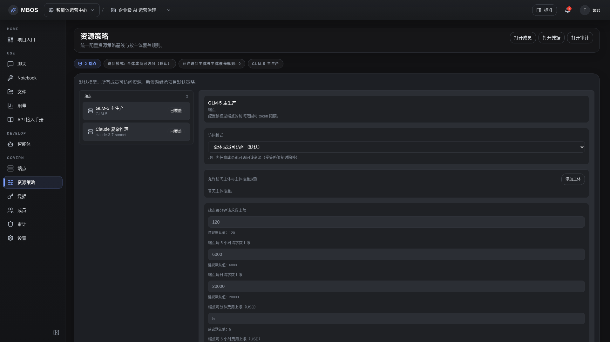

# 资源策略

- 功能分组：治理与运营
- 适用角色：项目管理员
- 功能路径：/zh-CN/workspaces/ws_default/projects/proj_001/resource-policy

## 页面截图

## 功能说明

资源策略页面用于定义 endpoint、文件库和 agent 的访问规则、限流和费用约束，是企业级 AI 治理的核心页面。

## 页面内容说明

- 页面展示资源分组、默认策略、subject allow-list 和 explainability 面板。
- 适合说明默认限额与按资源治理的思路。

## 用户操作

1. 选择资源类型和目标资源。
2. 调整访问模式、限流规则和费用上限。
3. 保存后到 Usage/Audit 页面核对效果。

## 截图文件

- [project-resource-policy.png](./project-resource-policy.png)

