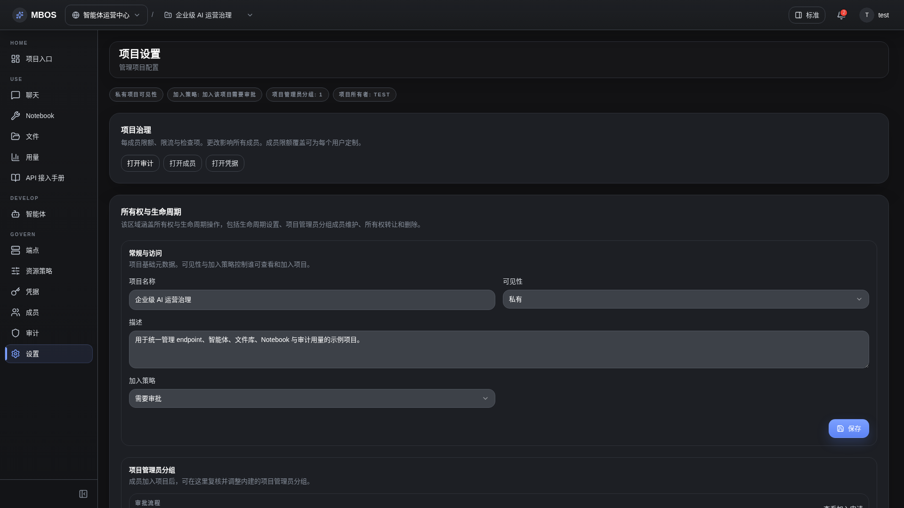

# 项目设置

- 功能分组：治理与运营
- 适用角色：项目管理员
- 功能路径：/zh-CN/workspaces/ws_default/projects/proj_001/settings

## 页面截图

## 功能说明

项目设置页用于维护项目基础信息和治理边界，是项目生命周期管理的重要页面。

## 页面内容说明

- 页面展示项目基础信息和可调整的设置项。
- 适合说明项目级配置与治理入口的关系。

## 用户操作

1. 查看项目基础配置。
2. 按需修改说明、可见性或相关设置。

## 截图文件

- [project-settings.png](./project-settings.png)

