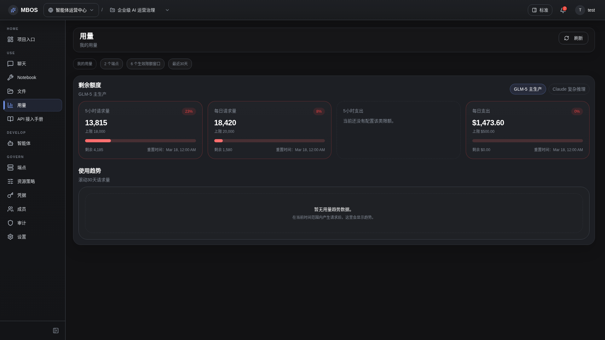

# 用量与限额

- 功能分组：治理与运营
- 适用角色：项目管理员
- 功能路径：/zh-CN/workspaces/ws_default/projects/proj_001/usage

## 页面截图

## 功能说明

用量页面展示 endpoint 的调用量、限额卡片和趋势，是成员自控和管理员巡检的重要界面。

## 页面内容说明

- 页面展示按 endpoint 切换的限额卡片和趋势图。
- 示例页面适合说明默认限额、最近 30 天趋势和资源切换。

## 用户操作

1. 选择目标 endpoint。
2. 查看限额卡片、进度和趋势变化。
3. 结合 Audit 和 Resource Policy 页面进行治理调整。

## 截图文件

- [project-usage.png](./project-usage.png)

