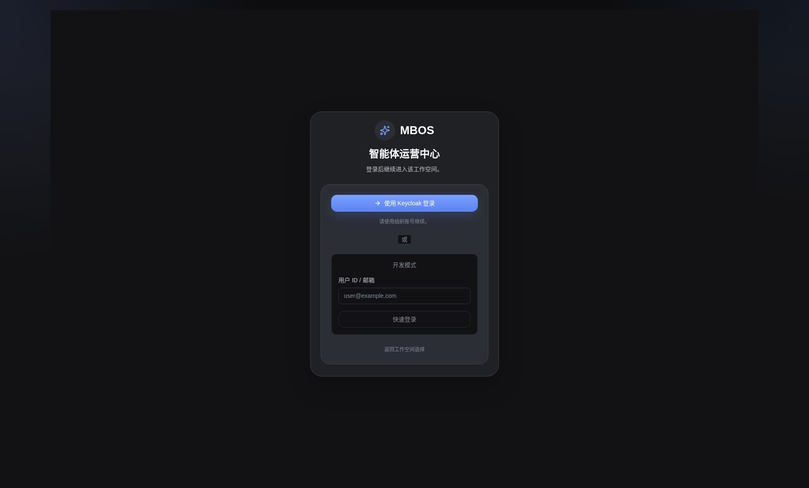

# 工作区登录

- 功能分组：工作区与项目
- 适用角色：业务用户
- 功能路径：/zh-CN/workspaces/ws_default/login

## 页面截图

## 功能说明

用户通过工作区登录页进入指定工作区，进入后可以直接访问项目列表和项目内的各项操作能力。

## 页面内容说明

- 页面展示当前工作区名称和登录入口。
- 用于承接从工作区选择页进入后的统一登录动作。

## 用户操作

1. 输入或选择企业身份后完成登录。
2. 登录成功后进入工作区内项目入口页。

## 截图文件

- [workspace-login.png](./workspace-login.png)

