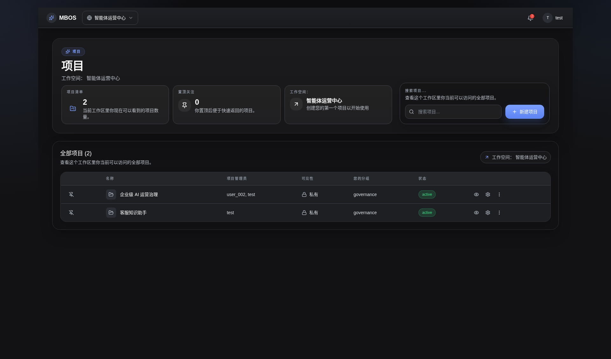

# 工作区项目入口

- 功能分组：工作区与项目
- 适用角色：工作区成员
- 功能路径：/zh-CN/workspaces/ws_default

## 页面截图

## 功能说明

工作区根路径直接承载项目入口，用户登录后即可查看项目、创建项目并进入项目工作台。

## 页面内容说明

- 页面展示当前工作区内的项目列表和搜索框。
- 具备权限的成员可直接创建新项目。

## 用户操作

1. 通过搜索定位目标项目。
2. 点击项目进入项目工作台。
3. 点击“创建项目”打开新建项目对话框。

## 截图文件

- [workspace-projects.png](./workspace-projects.png)

