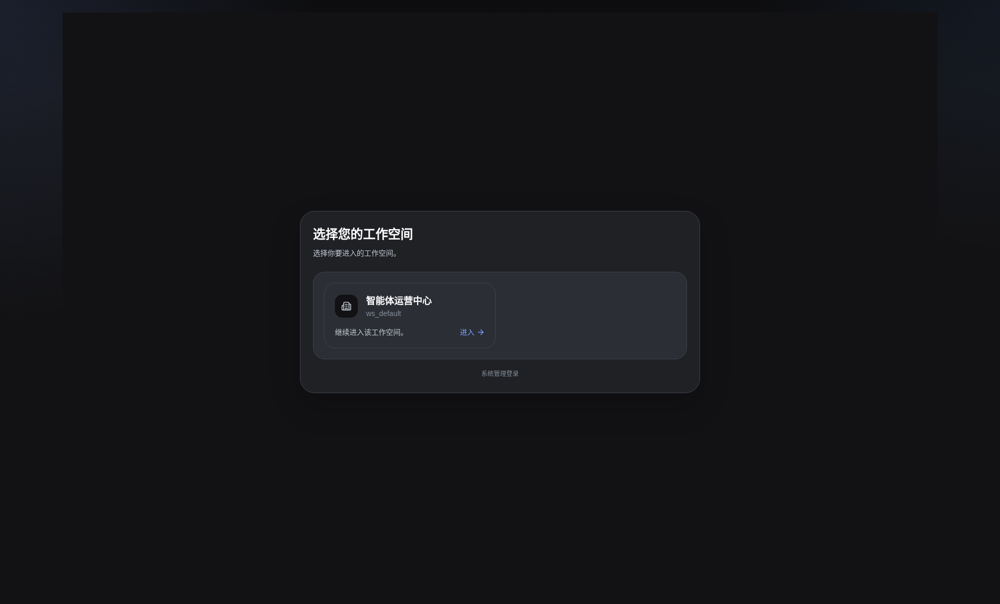

# 工作区选择

- 功能分组：工作区与项目
- 适用角色：业务用户
- 功能路径：/zh-CN/login/workspace

## 页面截图

## 功能说明

用户在进入系统后选择自己可访问的工作区，后续所有项目与治理操作都在所选工作区内完成。

## 页面内容说明

- 列表展示可访问的工作区卡片。
- 每个卡片提供进入工作区的入口。

## 用户操作

1. 浏览工作区列表。
2. 点击目标工作区进入登录或直接进入工作区。

## 截图文件

- [workspace-select.png](./workspace-select.png)

